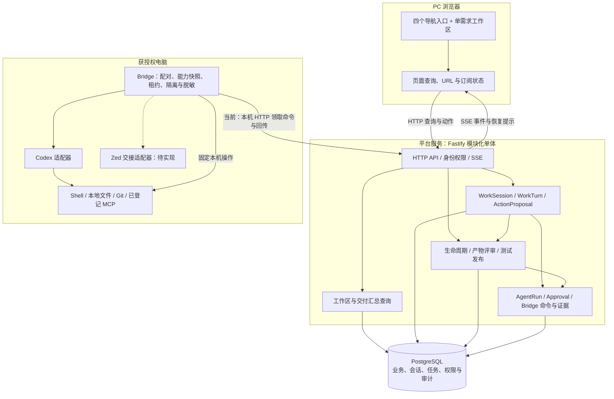
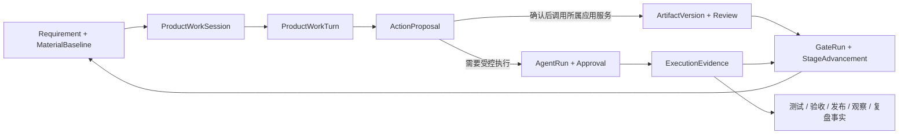
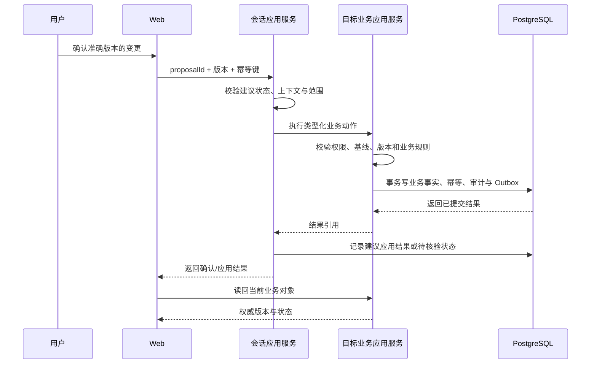

# 技术架构：业务事实、产品会话与本地执行分层

版本：V0.2 草案，2026-09-11。目标：承接 [产品方案](01-产品方案.md)，复用当前代码，明确新增设计和集成边界。最新交互选择为原版 `index.html`，见 [基线说明](README.md)；原版的对话、作业卡和终端镜像均需保留，并共用同一 runId 与执行事件源。除注明“当前代码/已确认”的内容，其余为待评审建议，不表示已经实现。

本轮原型动作与状态的细化见 [开发交接第 6 节](05-原版开发交接.md#6-正式架构与动作契约草案)。新增逻辑动作仍为设计草案，未修改现有 API 或 operation 枚举。

## 1. 架构选择

建议沿用已确认的 **TypeScript 单仓 + React PC Web + Fastify 模块化单体 + PostgreSQL + 本地 Bridge**。原版原型明确用户的工作组织方式，领域状态、权限、版本和受控执行仍由现有模块负责。

| 选择                                       | 收益                                              | 代价与适用结论                                                             |
| ------------------------------------------ | ------------------------------------------------- | -------------------------------------------------------------------------- |
| 复用现有模块，增加工作区查询组合与统一交互 | 保留既有状态、审计、Bridge 和测试资产，能分段迁移 | 需要收口 R3 与完善视图投影；建议采用                                       |
| 将原型脚本直接接 API                       | 初期页面迁移较快                                  | 浏览器内的状态机、布尔检查和固定步骤会与服务端事实冲突；不作为生产实现方式 |
| 重建后端或改为微服务/中心 Agent 集群       | 可重新组织服务与部署                              | 当前没有负载、独立团队或故障隔离证据支持成本；不纳入首期                   |

现有技术版本以仓库 `package.json` 和项目本地工具链为准，本轮不添加或升级依赖。

## 2. 总体结构与部署层次

当前本地运行使用 `pfc_local.pfc`，API 与数据库绑定 loopback。**平台支持通过本地 Bridge 调用 Shell 等工具，这是与用户电脑交互的基础能力。**浏览器负责发起任务和呈现结果，Shell、Git、Codex、MCP 由本地执行层调用，业务数据库由服务端访问。

**部署差异需要显式保留：**早期主 Spec 的团队目标是平台服务集中保存事实、Bridge 出站加密连接。当前 `apps/bridge/src/http-gateway.ts` 与 `runtime-config.ts` 只允许 `http://127.0.0.1:<port>`，运行循环使用轮询；这不是已经实现的跨机器 WSS。P1–P3 先复用本机通道，P4 按原团队目标完成 TLS/WSS、设备身份、重连、密钥轮换与撤销设计和验证。不能只将监听地址改成公网便宣称支持团队部署。

### 2.1 本地电脑交互与 Shell 能力

目标调用链为：**用户在工作区提出任务 → 平台绑定项目、设备与执行范围 → 本地 Bridge 调度 Agent/工具 → Shell、文件系统或 CLI 执行 → 输出、退出码、文件差异与执行状态回到工作区。**Bridge 需要在被操作的电脑上运行；在另一台电脑打开网页，不会自动获得该电脑的本地执行能力。

开发与测试需要支持读取和修改项目文件、搜索代码、查看 Git 状态与差异、运行格式化/测试/构建，以及启动、查看和停止本地预览进程。Shell 命令可由 Agent 在已授权任务内组织，不要求预先为每一条命令建立产品按钮。同一对话应能接续执行并展示结果，用户无需手工复制命令。IDE 打开与交接走对应适配器；桌面点击、窗口操控等图形交互仍需要专门适配，Shell 通道本身不代表完整桌面自动化。

执行层复用两条路径：一是 `packages/codex-adapter` 承接 Agent 的命令与文件工具调用；二是 Bridge 用结构化进程参数执行固定操作，例如 `git-workspace-inspector.ts` 和 `tool-capability-inspector.ts` 已使用 `execFile`。其中 `shell: false` 表示直接启动可执行程序、避免额外 Shell 解析，不表示禁止本地命令。首期无需另造一套通用远程终端。

当前 `workspace-write-session.ts` 已配置工作区写入沙箱，处理 `COMMAND_EXECUTION` / `FILE_CHANGE` 请求；契约已有 `FORMAT`、`TEST`、`BUILD` 等动作与命令开始/结束事件。现有 AgentRun operation 仍仅为 `ARTIFACT_CHECK`、`CONTROLLED_ARTIFACT_EDIT`，代码/测试完整任务及预览进程管理尚需按 CAP 设计、实现和验证。这里描述的是目标能力与已有代码基础，不代表完整本地工具链已经验收。

`product-work-turn-session.ts` 中“不调用 Shell/工具”只约束当前负责理解与建议的回合；需要执行时由 AgentRun 承接。该分工不应表现为产品无法操作电脑，也不应要求用户切换工作入口。

授权按任务范围生效：工作区、动作、网络、时限和资源预算明确后，范围内操作可连续执行，不把每条命令都变成一次人工确认。超出范围或命中明确需人工审批的操作才请求补充授权；批准产品方案不会自动取得发布或生产操作权限。命令执行还需有超时、取消、输出脱敏及进程归属记录；任务结束时清理临时进程，保留预览时展示 PID、端口与停止入口。这些属于后续执行设计与验收要求，本轮只澄清文档。

## 3. 模块职责与源码落点

| 模块/目录                                                                    | 当前可复用内容                                         | 原版落地需要的工作                                                 |
| ---------------------------------------------------------------------------- | ------------------------------------------------------ | ------------------------------------------------------------------ |
| `apps/web/src/work-sessions`                                                 | 会话、对话、建议画布、上下文、运行准备、证据、MCP 展示 | 按原版组合为连续工作区；统一选中需求/版本/运行；补加载、失败与恢复 |
| `apps/web/src/artifact-workspace`、`artifacts`                               | 产物目录与版本工作区                                   | 复用正文、评审和差异逻辑，接入侧栏与聚焦阅读                       |
| `apps/web/src/AuthenticatedPlatformRoutes.tsx`                               | 已有需求工作区、产物、作业和团队路由                   | 增加四入口壳层与 URL 查询状态；旧深链接继续定位对象                |
| `packages/ui`                                                                | 统一桌面控件、变量与 `/ui-kit`                         | 将原版视觉角色映射到三层变量；代表页先验收再迁移其他页面           |
| `apps/server/src/requirements`、`questions`、`gate-runs`、`material-impacts` | 生命周期、确认、推进、影响评估                         | 保持唯一业务规则，补用户阶段投影所需的查询字段                     |
| `apps/server/src/work-sessions`                                              | Session/Turn/Proposal、readiness、事件和 Bridge 调度   | 组合动作与结果，不直接写其他模块业务表                             |
| `artifact-collaboration`、`mcp-reads`                                        | R3 的正文、评审、追踪、MCP 请求链路                    | 补缺失版本字段、完整性与真实读回证据                               |
| `agent-runs`、`agent-controls`、`agent-approvals`                            | 受控执行、取消、核验、重试和审批                       | 扩展代码/测试等任务契约时逐项设计；不能把原型按钮映射为任意命令    |
| `teams`、`identity`、`workspaces`、`bridges`、`skills`                       | 身份、分工、工作区、配对、能力登记                     | 补团队阶段策略与会话临时选择的持久化和生效规则                     |
| `packages/domain`、`contracts`、`protocol`                                   | 状态机、DTO、Server/Bridge 协议                        | 增量扩展，不在 Web/Bridge 复制业务推进规则                         |
| `packages/persistence`                                                       | 事务、乐观锁、幂等、Timeline、Outbox、Audit            | 补尚无事实模型的 CAP-05 与能力配置；隔离迁移先验证                 |
| `apps/bridge`、`packages/codex-adapter`                                      | 本地执行、能力检查、会话隔离与协议适配                 | 收口 R3 MCP；实现统一容量预算；M3 增加 Zed 适配                    |

建议新增的首页、产品空间、交付中心与治理入口分别放入 feature 目录；`App.tsx` 仅组合路由和身份状态。工作区查询可以设独立 `workbench-query` 应用层，通过各模块只读端口汇总，不成为新的业务写入口。

## 4. 核心对象与事实所有权

| 对象                                | 拥有的事实                             | 必须绑定或遵守的约束                                             |
| ----------------------------------- | -------------------------------------- | ---------------------------------------------------------------- |
| Requirement / MaterialBaseline      | 当前门禁、范围基线和需求版本           | `currentStage/currentBaselineId/rowVersion` 权威来自生命周期模块 |
| Question / Decision                 | 原始回答、解释与确认范围               | 不覆盖旧确认；新回答保留替代关系                                 |
| Artifact / ArtifactVersion / Review | 产物目录、不可变版本、版本级评审       | Review 绑定准确版本 ID 与正文哈希；新版本不继承旧确认            |
| WorkSession / WorkTurn              | 需求作业上下文、用户意图和 AI 处理过程 | 会话打开快照不替代实时需求事实；每回合记录使用的上下文           |
| ActionProposal                      | 类型化建议、确认与应用结果             | 确认建议不等于应用成功，不等于执行授权                           |
| AgentRun / Approval                 | 受控任务与准确动作范围                 | 操作、目录、基线、影响限制、有效期和确认主体一致                 |
| ExecutionEvidence / Trace           | 可长期引用的结果摘要与类型化关系       | 证据绑定来源执行及业务版本；原始日志清理不删除被引用事实         |
| Team / Workspace / Bridge           | 组织边界、允许访问的工作区与设备身份   | 每次服务端操作重新校验，不能只依赖页面隐藏按钮                   |

CAP-05 的测试、产品验收、发布、观察和复盘记录是**后续设计对象**，当前没有据此完成的独立模块。建议分别拥有准确版本、执行/确认主体、结果、证据与时间，不用 `released=true` 或一个复盘布尔值替代全部过程。

## 5. 一致性与状态规则

### 5.1 三种状态分开保存

- **浏览状态：**正在查看的阶段、面板、选定版本、过滤条件、聚焦模式。适合 URL 与页面状态，不推进业务。
- **作业状态：**回合、任务、审批、取消、核验和证据归档。由对应执行模块和事件驱动。
- **业务事实：**当前门禁、材料基线、正式版本、评审、测试和验收结论。必须通过领域规则和 PostgreSQL 事务变更。

UI 的八阶段由服务端查询模型按[产品方案第 3 节](01-产品方案.md)投影，响应带规则版本。`viewStage` 可进入历史或未来视图；执行动作仍绑定当前需求/门禁/版本。投影本身不写 `Requirement.currentStage`。

### 5.2 一次确认的处理顺序

业务模块拥有自己的事务。若业务写成功而会话结果记录失败，依赖原幂等键与结果引用恢复，不重放真实副作用；建议显示“正在核验应用结果”。不能假定跨模块和外部执行具有一个全局事务。

### 5.3 并发、事件与恢复

沿用 `If-Match/rowVersion`、`Idempotency-Key` 与请求哈希。版本冲突时保留草稿并读回最新事实；相同请求重试返回原结果；同一键不同内容拒绝。新材料使旧建议、门禁或评审不再适用于当前基线时，保留旧记录并明确失效范围。

SSE 是通知与恢复通道。按会话/运行序号去重，发现缺口先补拉或重载；完整读模型仍来自 HTTP/数据库。先读取带序号的快照，再订阅快照之后的事件，避免加载与订阅之间丢消息。不得承诺网络“只投递一次”；副作用唯一性依赖事务、租约、幂等和执行侧核验。

页面刷新：恢复 URL → 查询身份和需求 → 查询对应会话、产物和任务 → 判断基线是否过期 → 恢复事件流。切换需求时取消旧请求/订阅，并拒收与当前上下文不匹配的迟到响应。未发送输入可本地暂存，需按用户、团队、需求和会话分区，退出登录清理；受限正文默认不落浏览器长期存储。

### 5.4 取消与重试

现有 AgentRun 有 `CANCELLING/CANCELLED/UNKNOWN/VERIFYING/RETRY_QUEUED`，没有可任意往返的通用 `PAUSED` 状态。建议界面将原型“停止”落成取消请求：执行侧确认前为“正在停止”，无法确认则为 UNKNOWN。

已取消/失败任务的“继续”落成关联旧 run 的新尝试，使用现有控制服务重新核验基线、授权和可恢复性。正在等待输入或审批的作业可按合法事件继续原运行。不要新增一个仅用于模拟“进度条续跑”的暂停状态。

## 6. 查询、接口与前端组合

当前可复用的主要接口族：

| 能力       | 源码中已有接口示例                                                                                        | 接入原则                             |
| ---------- | --------------------------------------------------------------------------------------------------------- | ------------------------------------ |
| 会话与准备 | `GET/POST /api/v1/requirements/:id/work-sessions`；`GET /api/v1/work-sessions/:id/readiness`              | 需求对应会话；准备状态有具体阻断码   |
| 对话与建议 | `POST /api/v1/work-sessions/:id/turns`；`POST /api/v1/action-proposals/:id/decisions`                     | 消息进入 Turn；建议经业务服务应用    |
| 会话事件   | `GET /api/v1/work-sessions/:id/events`                                                                    | 事件携带序号，重连可补拉             |
| 文档       | `GET /api/v1/artifacts/:artifactId/versions/:versionId/content`；`GET /api/v1/artifacts/:artifactId/diff` | 正文与差异绑定准确版本，保留大小限制 |
| 评审与追踪 | `POST /api/v1/artifact-versions/:versionId/reviews`；`GET /api/v1/requirements/:requirementId/traces`     | 版本评审与双向关系复用 R3            |
| 运行控制   | `POST /api/v1/agent-runs/:id/controls`                                                                    | 不绕过现有取消、核验、重试与权限规则 |

建议新增工作台/交付汇总只读查询，以及 CAP-05 和团队阶段策略接口。具体路径、DTO 和 schema 在对应实施设计中确认；不能将此处接口意图当作已经存在的服务。

工作区视图模型至少携带：需求 ID、当前基线/版本/门禁、投影阶段、所看阶段、会话 ID、选中产物版本、运行 ID、可执行动作与阻断原因、快照序号。汇总可通过服务层跨模块读端口完成；一致性不足时返回待刷新，不拼接不同版本并冒充同一时刻结果。

前端复用现有 hooks、API 和组件；仅从结构化返回渲染状态，不从模型自然语言识别“通过”“批准”来改状态。正文显示采用安全的文本/Markdown 渲染，避免原型 HTML 拼接方式进入生产界面。

## 7. 能力、授权与运行边界

有效能力集合建议按以下顺序计算：**已登记固定版本 ∩ 团队策略允许 ∩ 阶段默认或会话选择 ∩ 运行时可用 ∩ 当前动作与数据授权**。会话选择可替换默认选择，不能绕过前后几层。

当前 SkillRelease 已有来源、版本、哈希、风险、适用范围和评测状态；MCP 已有能力登记与执行请求。团队阶段策略、会话覆盖和策略版本快照属于增量设计，不再建立一份与这些登记脱节的布尔目录。

MCP 延续 R3 的已登记、经复核只读能力路径；工具名、输入 schema 和配置指纹需匹配。平台开关不修改用户 MCP 配置。真实业务写 MCP、市场安装、外部账号登录另行定义范围。

代码、测试等新增任务按明确 operation 类型扩展，Shell 是这些任务可使用的执行工具。请求必须包含允许路径、动作、文件/字节限制、网络边界与超时，Bridge 使用隔离工作胶囊、租约和允许清单执行。浏览器不持有 Bridge 凭据，服务端不向页面输出原始敏感日志。

团队权限与单次动作授权分别校验。确认产物、批准计划、批准执行、确认验收各是独立事实，UI 可以合并展示，但不能合并授权含义。

## 8. 数据演进与迁移顺序

源码已有 001–009 共 9 个迁移文件。其中 007 为产品会话，008 为产物正文/评审/追踪，009 为执行证据/MCP。2026-09-09 检查点称 008/009 尚未应用标准 `pfc`，本次未连接数据库复验。

建议顺序：

1. P0 读回标准库 migration 和目标表结构，记录当前代码、迁移和运行配置指纹。
2. 修复 R3 契约不一致，在隔离 `codex_test_*` 验证既有 008/009 与 repository/API。
3. 对八阶段投影所需检查点、能力策略/会话覆盖、CAP-05 记录进行字段与所有权设计。优先复用现有事实，缺失再增量迁移；本方案不预占迁移编号。
4. 按确认后的本地 schema 变更范围做预检、备份与迁移，完成数据库/API/UI 独立读回。
5. 只有兼容与恢复验证满足，才切换业务入口；移除体验模式需保留既有证据，不将演示记录迁成业务事实。

回滚优先关闭新入口并回到兼容旧版本。不可变正文、评审和审计属于事实，不能通过删除新表来消除已产生记录。数据库恢复、可逆变更及后续修复方案必须按实际迁移逐项评审。

## 9. 容量、性能、观测与成本

已确认的首期估算假设为不超过 10 名用户、5 个在线 Bridge、每 Bridge 最多 3 个并行 AgentRun；事件/日志默认保留 30 天。它们不是已经测得的容量或吞吐保证。当前 runtime 使用 `maxActiveSessions: 3`；后续须核对 AgentRun、WorkTurn、MCP 是否共享资源预算，不能各自扩大为 3 倍并发。

R3 设计已有正文 512 KiB / 20,000 行、Diff 返回 2,000 变更行 / 200 hunk、MCP 默认 10 秒且最长 30 秒、同会话最多 1 个 MCP 查询等有界规则。落地时复核源码与配置一致，不以文档存在代替实测。

| 面向场景         | 实现/验收要求                                                                              |
| ---------------- | ------------------------------------------------------------------------------------------ |
| 列表与时间线增长 | 分页/游标、有限返回、索引覆盖真实查询；正文按需载入                                        |
| 长任务与队列     | 有界并发、租约超时、取消与 UNKNOWN；队列过长显示等待和原因                                 |
| SSE 与重连       | 有序恢复、背压/批次、连接数与序号缺口监测；会话销毁释放订阅                                |
| 模型与工具成本   | 保存可获得的 usage 与耗时；估算和实测分开；不存在计量时不显示虚构金额                      |
| 故障定位         | 同时可关联 requirementId/sessionId/turnId/runId、版本与 requestId；日志摘要脱敏            |
| 运行监测         | API 错误/延迟、队列与租约、Bridge 心跳、取消耗时、UNKNOWN 数、归档积压、版本冲突、越权拒绝 |

精确响应时间和资源阈值在 P0/P1 用目标设备与数据量测量后确认。禁止从静态原型响应速度推断正式系统性能。

## 10. 验证、验收与演进条件

单元验证保护状态机、投影规则、能力策略和版本不变量；契约验证保护 API/Bridge schema；隔离 PostgreSQL 验证保护事务、幂等和迁移；浏览器验证保护同需求连续操作、键盘、刷新与三宽度呈现。

关键反例必须覆盖：同一确认重复点击、过期版本、迟到事件、Bridge 断线、取消结果未知、授权过期/撤销、只读能力漂移、归档失败、测试版本错配和发布未执行。测试数据先设计，使用确定性工厂、`CODEx_TEST_` 前缀和清理读回。

每段实施按 Quick → Core → 适用 Full 执行，包含 `check:delivery-governance` 与 `check:ui-design`。真实集成需独立业务事实读回；三宽度视觉接受与角色验收单独记录。当前 5 处类型错误是恢复实施的入口阻断，详见[核验记录](04-核验记录.md)。

P4 的团队部署需确认应用内邀请账号、入口与 TLS、Bridge 设备信任、备份恢复、发布产物、部署负责人、观测窗口和回滚触发。SSO、微服务或中心 Agent 集群只有在后续明确需求与实测证据支持时再评估。
