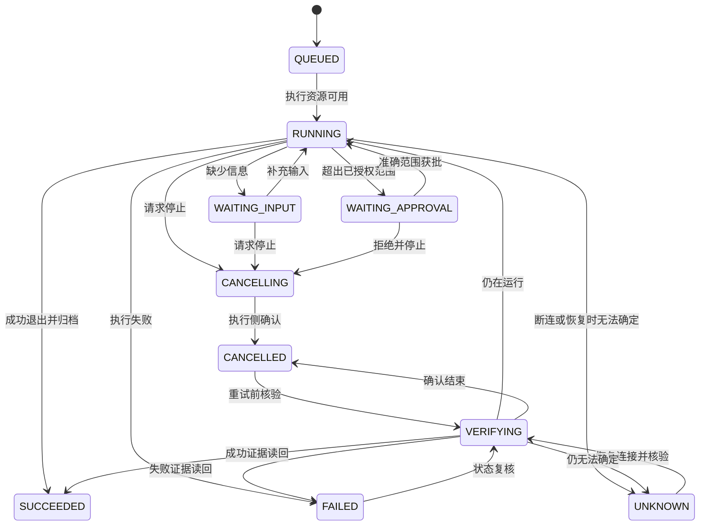
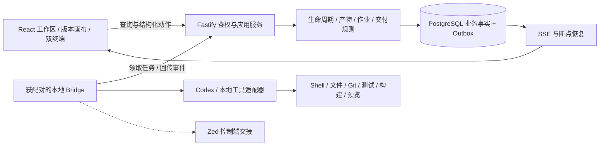

# 原版交互原型：产品与开发交接

> 2026-09-12实施更新：本轮复核缺陷已修复；当前规则、验证入口和剩余产品范围以 [修复后开发交接](09-原型修复后开发交接-20260912.md) 与 [修复报告](../../quality-gate/reports/PROTOTYPE-REMEDIATION-20260912.md) 为准。下文保留此前的审查/规划记录，不作为本轮未修复清单。正式工程状态及人工接受不由原型回归提升。

> 修复前复核（用户2026-09-11晚更新版）：附件、引用、差异采纳和下载入口已经存在，但实测发现数据覆盖、跨需求引用、权限和对象/版本错绑等阻断，尚不是生产级开发基线。见 [当前审查](../../quality-gate/reports/PROTOTYPE-PRODUCTION-READINESS-REVIEW-20260911.md) 和 [补齐方案](07-生产级原型验收标准与补齐方案.md)。下面的“最终版回填”为更新者的历史实现记录，不作为本轮验收通过证据。

> **最终版回填（2026-09-11）**：原版 `index.html` 已按能力缺口优先 1–6 与规则问题 1–6 完成增量实现——随消息附件（多选/拖拽/粘贴、队列、解析状态、预览/重试/移除）、本轮上下文引用（材料带版本、产物带版本ID，可排除）、对话字段级 Diff 采纳/拒绝（采纳生成新版本并使下游过期）、停止答复/引用回复/失败重发、产物与证据与交付包真实下载、成功作业工作区文件与 Diff 预览。验证：Playwright 全流程回归 0 console error；“把 30 天改为 45 天”Diff 采纳生成 idea v2 并使下游全阶段过期；proposal 过期点击提示“建议过期，请重新发起对话”；重发形成新回合。本稿字段规则表第 3 节中“原型约束”一列已随实现更新；正式接入要求不变。改动前备份见原型目录 `_backup/final-before-<时间戳>/`。

2026-09-11，交互草案 V0.2。入口：[index.html](../../../output/pfc-workbench-prototype/index.html)。本版以用户选择的原版为基础，补齐可操作的主流程、异常处理和规则说明，可用于方案评审、任务拆解及验收用例设计。

用户已授权本轮原型完善。正式平台开发仍暂停；本稿中的设计建议和演示状态不改变主 Spec V0.1/R3、5 CAP / 26 Unit 或工程验收结论。Parent POD 为 POD-PFC-001，当前 M2，唯一工程下一路由仍为 `POD-PFC-001/M2/R3a/artifact-collaboration-tdd`。原型自动验证通过，人工视觉及业务确认待陈立查看本版后给出。

## 1. 从哪里开始评审

直接在浏览器打开入口即可，无需启动平台。应保留整个 `pfc-workbench-prototype` 目录，入口会读取同目录 `original/` 中的脚本和样式。演示数据保存在该浏览器的原型独立存储中；切换浏览器、移动文件路径可能得到新的演示空间。

建议按以下顺序走查：

1. **现有开发需求**：我的工作台 → R-1042，查看三栏、作业卡、双终端、能力快照和证据。停止 → 等待取消确认 → 核验 → 创建新尝试，比较新旧 runId。
2. **从零完成一条需求**：创建需求 → 回答问题 → 确认草案 → 需求范围与 Unit/AC → 方案确认 → 发起作业 → 确认提测交接 → 测试 → 产品验收 → 发布申请/批准/执行 → 观察复盘。
3. **变更与返工**：编辑已确认文档生成新版本；登记新材料并纳入基线；验收驳回后重新开发。旧版本、旧作业和失败记录应能继续查看。
4. **异常恢复**：右上角“交互原型 · 场景切换”提供只读、断连、未知、等待输入/授权、版本冲突、发布过期/失败、观察窗口推进、空/加载/错误状态。
5. **跨需求管理**：产品空间核对材料、版本、关系与时间线；交付中心核对同一条需求的汇总；治理中心登记能力、团队成员和本地电脑。

作业按合成时钟推进；终端文本、测试、发布、MCP、配对和预览都是模拟结果。场景切换是评审辅助入口，正式产品不保留强制改状态的按钮。重置只删除本原型的存储，不清空浏览器其他数据。

## 2. 页面与职责

| 页面 / 区域           | 主操作                                                   | 结果与定位规则                                       |
| --------------------- | -------------------------------------------------------- | ---------------------------------------------------- |
| 我的工作台            | 创建需求、继续工作、查看待办与运行恢复                   | 汇总当前演示事实；已最终复盘的需求退出待办           |
| 产品空间 / 需求清单   | 按编号、名称、负责人筛选；进入需求                       | 与工作区同一份需求记录                               |
| 产品空间 / 材料       | 登记文本或附件、查看内容、处理影响                       | 材料有独立编号、用途和级别，纳入变更后增加基线       |
| 产品空间 / 产物版本   | 打开当前或历史版本、比较、评审                           | 正文不可覆盖历史版本；过期确认显示“需重新评审”       |
| 产品空间 / 关系追踪   | 查看需求、CAP、Unit、AC、产物、作业/测试                 | 可定位需求版本与执行证据；正式映射必须保存显式关系   |
| 产品空间 / 决策时间线 | 查看动作、时间、执行人并定位阶段                         | 不通过跳转按钮直接推进业务状态                       |
| 交付中心              | 按需求查看开发、测试、验收、发布、观察                   | 汇总关联记录，进入同一工作区处理                     |
| 工作区 / 左栏         | 阶段导航、材料、关联工作区、临时能力                     | 当前阶段与查看阶段分开；临时能力仅影响后续作业       |
| 工作区 / 中央         | 对话、问题、文档、作业与交付动作                         | 阶段底部列出未满足条件；输入草稿按需求隔离           |
| 工作区 / 右栏         | 终端、画布、证据，长文聚焦阅读                           | 与中央共用 requirementId、artifactVersionId、runId   |
| 治理中心              | 能力登记/复核/启用、阶段绑定、成员、工作区、Bridge、审计 | 登记、可用、实际执行分别表达                         |
| 全局搜索              | 搜索需求或跳到一级入口                                   | URL 保留需求、阶段、面板、版本和作业；支持浏览器后退 |

## 3. 字段与交互规则

本表“原型约束”可直接点击验证；“正式接入”是实现前必须落入接口和数据设计的要求。

| 对象       | 原型字段和校验                                                                                 | 正式接入必须补充                                                                                                               |
| ---------- | ---------------------------------------------------------------------------------------------- | ------------------------------------------------------------------------------------------------------------------------------ |
| 需求       | 名称、目标、范围、负责人必填；名称 ≤80 字，目标 ≤8000 字；生成编号                             | 团队归属、成员有效性、字段长度一致性、revision、创建人/时间、幂等请求                                                          |
| 材料       | 名称或附件、文本或附件必填；TXT/MD/PDF/DOCX/PNG/JPG ≤10MB；TXT/MD 预览 ≤200KB；公开/内部/受限  | 对象存储、内容哈希、解析状态、来源版本、引用权限、扫描与留存；PDF/Word/图片不能将元信息当已解析正文                            |
| 材料使用   | 受限材料仅登记；想法阶段允许材料直接纳入，后续阶段先评估影响；读取附件期间切换需求不会改变归属 | 将原型的单个待影响指针替换为影响记录集合，支持多材料版本逐项处理，权限以服务端校验为准                                         |
| 澄清与范围 | 问题答案不得为空；维护 CAP 标识、Unit 和 AC；确认需求版本表示接受当前内容                      | 问题解决人、决定依据、可撤回规则、多 CAP/多 Unit 汇总；草案中的示例 AC 必须由业务确认                                          |
| 产物版本   | 字段式正文、版本号、评审意见；编辑生成新版本；保存时发现新版本则保留本地草稿                   | 正文 hash、父版本、来源 runId、revision、不可变内容和独立确认记录；大文本分段读取与 Diff                                       |
| 作业       | 需求/方案版本、工作区、工具范围、能力版本快照、控制端、状态/进度/退出码、新旧作业关系          | repo/branch/commit、设备/租约、会话/线程定位、scopeHash、网络/文件边界、资源预算、超时及执行证据                               |
| 测试与缺陷 | AC → 测试结果；失败形成 OPEN 缺陷；填写修复说明为 RESOLVED，复测通过为 CLOSED                  | 显式用例关系、环境、配置来源、测试数据工厂、测试程序/日志、测试批次历史；自动与人工结果分开                                    |
| 产品验收   | 功能/AC、权限/异常、版本/证据三项勾选，结论与残余风险必填，记录执行人                          | acceptanceId、确认时间、准确产物/测试版本、责任角色、拒绝理由及重新验收范围                                                    |
| 发布       | 环境、范围、回滚步骤、观察窗口；窗口 1–168 小时，审批 30 分钟有效；批准和执行分开              | 冻结 artifact/build/commit/test/acceptance 标识及 hash、环境目标、审批人/权限/有效期/幂等键；30 分钟是演示参数，正式按策略配置 |
| 观察复盘   | 指标及来源必填；最终结论必填；成功发布且窗口结束才能最终完成                                   | 多条带时间的观测记录、监控链接、阈值、实际发布版本、具名最终验收、残余风险与后续事项                                           |
| 能力与设备 | 能力名称/类型/来源/版本/描述，先复核后启用；设备配对/连接/撤销可演示                           | 来源可信性、工具 Schema/版本指纹、许可与资源预算；一次性配对码、设备密钥、权限撤销与审计                                       |

原型的 `stamp` 组合材料基线和想法/需求/设计版本，用于演示过期判断。**正式发布不能仅复制这一字段**：必须另外绑定开发产物、构建、测试、验收和目标环境的完整快照，避免“需求没变但代码已变”仍复用审批。

## 4. 状态与不可省略的规则

### 4.1 阶段只是工作视图

| 用户阶段 | 门禁投影              | 原型退出条件                                                 |
| -------- | --------------------- | ------------------------------------------------------------ |
| 想法     | G0–G2                 | 已纳入可用材料、全部问题已回答、草案当前版本确认             |
| 需求     | G3–G5                 | 有 Unit 和 AC、当前需求版本确认                              |
| 设计     | G6–G8 / G9-A 方案确认 | 当前技术方案确认                                             |
| 开发     | G9-A 实施 / G9-B 提测 | 当前基线成功作业、提测交接版本确认；验收退回后的旧作业不计入 |
| 测试     | G10 测试              | AC 测试均通过、缺陷均关闭                                    |
| 验收     | G10 产品验收          | 具名产品结论通过；拒绝则回开发                               |
| 发布     | G11                   | 审批有效且执行成功，随后进入观察                             |
| 观察复盘 | G11 观察 / G12        | 窗口结束、指标来源和结论完整、发布状态成功                   |

服务端继续保留完整 G0–G12 和 CAP Ready 规则；八个视图不能压缩或取代真实门禁。多 CAP 的不同门禁位置必须由查询模型聚合；原型为一条需求提供一个 CAP 的代表性路径，不表示多 CAP 状态机已经完成。

上游新版本或材料变更使下游评审、测试、验收和未执行审批过期。历史正文与运行记录继续保留；旧基线作业迟到的成功结果不能覆盖当前提测交接，也不能满足当前门禁。浏览历史/未来阶段不自动通过任何门禁。

### 4.2 AgentRun

- 停止保留实际进度；先显示 CANCELLING，不能立即写 100% 或成功。
- UNKNOWN 不允许直接复制任务重试；连接恢复后读回进程与运行记录。原型核验弹窗允许选择模拟回传，正式界面由 Bridge 结果驱动。
- 已核验的失败/取消可以创建新尝试；新 runId 保存 parentId，不覆写旧记录。成功作业可以另发新作业用于返工或新基线。
- 同一个 runId 的中央终端与右侧终端消费同一事件源。Web/Zed 表达一个当前控制端，观察者可读；正式接入还需控制租约与冲突拒绝。
- 原型最大并行数为 3，计时进度只是演示。正式排队和限额由执行层负责，没有可靠总工作量时显示步骤与耗时，不计算虚假的百分比。

### 4.3 发布与回流

`PENDING → APPROVED → SUCCEEDED → 观察 → 最终复盘`。

PENDING 可拒绝；版本变化为 STALE，过期需重新申请。APPROVED 仅表示发布范围被批准；点击执行才产生发布结果。失败保留 FAILED，可执行回滚为 ROLLED_BACK，再重新准备。成功发布后的观察异常也可回滚。重新申请保留旧发布记录。

验收拒绝记录原因并返回开发；已有成功作业被排除，必须产生新的开发成功与测试结果。不能重复点击旧的“确认提测”跳过返工。

### 4.4 能力生效与权限

有效能力 = 团队已启用能力 ∩（当前阶段默认绑定，经本需求当前阶段的临时选择调整）。团队停用不能由临时开关绕过；登记尚未复核的能力不能启用；调整默认配置不改已经运行的能力版本快照。

原型只模拟负责人/只读的权限对比，成员登记不触发真实身份切换。正式实现应按当前身份模块的团队成员、角色及工作分工分别校验读、编辑、执行、审批、治理权限，不能把演示角色开关用作鉴权。

## 5. 26 个 Unit 的交接矩阵

本表是交互与接入追踪表，不是完成度台账。每行都对应原型入口及可验证结果；最后一列说明真实系统还需落到哪里。完整工程状态仍以交付台账及各项现场证据为准。

| Unit                                | 原型入口 / 动作                     | 验收要点                                       | 正式接入                                                        |
| ----------------------------------- | ----------------------------------- | ---------------------------------------------- | --------------------------------------------------------------- |
| UNIT-PFC-01-01 需求工作清单         | 首页待办、产品空间筛选              | 新需求出现；最终完成后退出待办；进入准确需求   | requirements 查询、团队权限、分页                               |
| UNIT-PFC-01-02 想法与材料登记       | 创建需求、附件、材料影响            | 必填校验；受限材料不进入 AI；变更增加基线      | requirements、materials、material-impacts、文件存储             |
| UNIT-PFC-01-03 问答与决策确认       | 问题卡、保存回答、确认草案          | 未回答有阻断；确认绑定版本                     | questions、decisions、会话建议采纳                              |
| UNIT-PFC-01-04 门禁运行与路由       | 阶段底部待办与下一阶段              | 导航不推进；阻断条件清楚；回流可继续           | gate-runs、完整 G0–G12 状态机与投影                             |
| UNIT-PFC-01-05 上下文恢复与时间线   | 刷新、后退、时间线定位              | 草稿和选中对象恢复，不串需求；未知先核验       | work-sessions、事件游标、持久上下文                             |
| UNIT-PFC-02-01 阶段产物目录         | 产品空间产物、右侧画布              | 当前版本与历史目录一致                         | artifacts/repositories、版本查询                                |
| UNIT-PFC-02-02 产物生成或检查请求   | 对话、阶段产物、只读 MCP 演示       | 草案待确认；能力不可用时阻断，不制造真实成功   | work-turn/proposal、AgentRun、artifact-collaboration、mcp-reads |
| UNIT-PFC-02-03 版本查看、编辑与比较 | 编辑草稿、版本选择、聚焦、比较      | 旧正文不变；新版本冲突保留输入                 | R3a 正文、hash、Diff、乐观并发                                  |
| UNIT-PFC-02-04 产物评审与确认       | 评审意见、修改建议、当前版本确认    | 准确版本有结论；上游变化显示需重新评审         | R3a 版本级 review/confirmation                                  |
| UNIT-PFC-02-05 双向追踪             | 关系追踪、产物到证据定位            | 同一需求及版本能找到 Unit、AC、run/test        | 显式 trace link、反向查询、缺失引用提示                         |
| UNIT-PFC-03-01 发起 Agent 作业      | 开发 → 准备范围 → 执行              | 绑定方案、工作区和能力快照；已有未结束作业阻断 | agent-runs、readiness、Codex adapter、Bridge                    |
| UNIT-PFC-03-02 实时执行事件         | 作业卡、双终端                      | 状态与行内容一致，带 runId/退出码              | SSE/outbox、eventId/sequence、去重和补拉                        |
| UNIT-PFC-03-03 范围审批             | 等待授权 → 查看范围 → 批准/拒绝     | 准确新增范围获批才继续                         | agent-approvals、scopeHash、时效与撤销                          |
| UNIT-PFC-03-04 Web/Zed 作业交接     | 交给 Zed / 取回 Web                 | 同一 runId，控制端变化，观察端继续同步         | Zed 会话定位、控制租约、设备能力协商                            |
| UNIT-PFC-03-05 作业恢复与控制       | 停止、刷新未知、核验、新尝试        | 不伪造成功；核验区分五类结果；重试新 id        | agent-controls、进程读回、恢复和幂等                            |
| UNIT-PFC-03-06 结果与证据归档       | 成功提测交接、证据摘要、时间线      | 旧作业保留；当前证据可追溯；摘要带 demo 标记   | 不可变 evidence/manifest、文件差异、来源归档                    |
| UNIT-PFC-04-01 团队工作空间         | 治理团队、产品空间                  | 当前团队范围一致                               | teams、成员关系、租户边界                                       |
| UNIT-PFC-04-02 成员角色与分工       | 新增成员、只读场景                  | 只读操作被拒；成员登记不自动取得权限           | identity、role assignment、CAP/Unit 分工                        |
| UNIT-PFC-04-03 仓库工作区登记       | 工作区名称与路径登记                | 当前需求关联可查看                             | workspaces、路径/仓库/分支检查、dirty 状态                      |
| UNIT-PFC-04-04 本地桥接器配对       | 配对、离线、撤销、重新配对          | 离线不可开工，撤销记录保留                     | bridges、一次性配对码、设备密钥、连接与撤销                     |
| UNIT-PFC-04-05 权限与执行审计       | 装载与审计、run 快照                | 配置及操作有对象/人/时间；旧快照不变           | access policy、append-only audit、脱敏与留存                    |
| UNIT-PFC-05-01 提测交接与测试映射   | 开发成果、用例与提测说明            | 交接包含当前 run、AC、验证和风险               | handoff、test case、显式 AC/Unit/evidence 关系                  |
| UNIT-PFC-05-02 测试与产品验收       | 测试失败、修复、复测、具名验收/拒绝 | 测试通过不等于产品接受；拒绝产生返工           | test execution、defect、acceptance 与版本约束                   |
| UNIT-PFC-05-03 发布准备评审         | 发布表单、批准/拒绝、过期           | 环境/版本/回滚完整；批准不执行                 | release proposal、审批快照及独立权限                            |
| UNIT-PFC-05-04 发布与观察记录       | 执行、失败/回滚、观察记录           | 真实执行结果单独记录；窗口关联成功版本         | deployment adapter、smoke/readiness、指标时间序列               |
| UNIT-PFC-05-05 最终验收与复盘       | 保存观察、窗口结束、最终复盘        | 未到窗口不能关闭；结论与后续事项可读           | final acceptance、retrospective、指标与证据归档                 |

原型中的 Unit/AC 行按代表样例组合显示；多对多追踪、CAP 分工、完整测试批次历史和多设备并发，必须在对应 Unit 正式方案中扩展，不得因原型简化而静默删减原范围。

## 6. 正式架构与动作契约草案

继续采用 React 19 / Vite 8、Fastify 5 模块化单体、PostgreSQL 18 / Kysely 和本地 Bridge。原型可以直接用于浏览和讨论；正式应用复用其布局、文案、状态和动作规格，按现有模块接入，不把浏览器中的模拟状态机当业务权威。

**平台允许使用 Shell 等本地工具。**一个任务绑定电脑、工作区和范围后，范围内可连续读写文件、运行命令并展示结果；新增范围再请求授权。浏览器通过平台与 Bridge 发起操作，本身不直接执行 Shell。原型“启动预览”没有真实进程，正式版本要显示地址、PID、端口、归属作业和停止入口。

下列是逻辑动作，供服务设计对照现有接口复用；不是本轮新增的 API 路由或 operation 枚举。

| 逻辑动作                           | 最小输入                                                                                        | 成功结果 / 失败语义                                         |
| ---------------------------------- | ----------------------------------------------------------------------------------------------- | ----------------------------------------------------------- |
| CreateRequirement                  | teamId、name、goal、scope、ownerId、idempotencyKey                                              | requirementId/revision；成员无效/字段不符拒绝               |
| RegisterMaterial / DecideImpact    | requirementId、sourceRef/hash/classification/useScope、baseRevision、decision/reason            | materialVersionId/baselineId、受影响对象；旧基线冲突不覆盖  |
| AnswerQuestion / ConfirmDecision   | questionId、answer/decision、expectedRevision                                                   | 决策事件、责任人、门禁待办变化                              |
| SaveArtifactVersion                | artifactId、baseVersionId/hash、正文、sourceRefs                                                | 新 artifactVersionId/hash；409 冲突携当前版本，保留本地草稿 |
| Review / ConfirmArtifact           | artifactVersionId、reviewType、意见、expectedRevision                                           | 独立评审/确认记录；不能确认已被替换的版本                   |
| AdvanceGate                        | requirementId/capId、expectedGate、evidenceRefs                                                 | 当前路由与 blockers；不满足时返回具体引用                   |
| StartAgentRun                      | requirement/cap/unit、baseline/versions、workspace/bridge、capabilitySnapshot、operation、scope | runId、状态、事件游标；缺依赖/范围不符不启动                |
| ControlAgentRun                    | runId、commandId、control、expectedState/lease、input 或 approvalRef                            | 控制已接收；最终结果另由执行事件回传                        |
| RecordTest / Accept                | handoffVersionId、testRunId、case/AC/evidence、结果、验收意见                                   | 测试/缺陷/验收事实，当前交付基线变化                        |
| Prepare / Approve / ExecuteRelease | 冻结交付快照、target、scope、rollback、window、approvalRef、idempotencyKey                      | 各自独立记录；过期/变更/无权限拒绝；超时结果未知需核验      |
| Observe / FinalAccept              | releaseId、observedAt、metrics/source、结论、残余风险、owner                                    | 观察/最终验收记录；窗口或条件不符返回 blocker               |

每个异步事件至少携带 eventId、sequence、requirementId、runId、type、occurredAt、payload 和脱敏级别。客户端按 runId 分流、sequence 去重；断连补拉或重建快照，不能靠动画补全缺失执行事实。写动作需要幂等键及乐观并发，业务落库与 outbox 同事务。

当前源码中的 AgentRun operation 仅有 `ARTIFACT_CHECK` 和 `CONTROLLED_ARTIFACT_EDIT`（依据 02 技术架构的代码核验）。原型的开发、测试、预览任务要先确认契约扩展及适配器，不能直接硬接现有产物检查接口。现有 Bridge 为本机 HTTP 领取/回传；团队远程加密连接和 Zed 实际交接按路线图设计。原版能力目录中的 VS Code 仅保留展示，不能据此扩大首期 IDE 实现范围。

## 7. 源码组织与迁移顺序

| 原型源码                                        | 当前职责                       | 正式归属建议                                                  |
| ----------------------------------------------- | ------------------------------ | ------------------------------------------------------------- |
| original/data.js                                | 原版图标、场景素材、能力目录   | 图标及 token 进入 packages/ui；合成样例进入 test-data         |
| original/base.css、guide.css                    | 原样式与表单/状态扩展          | 三层 token 与 /ui-kit，不直接把页面视觉常量粘入业务页         |
| original/model.js                               | 工厂、演示状态、规则与事件     | 规则落 domain/application；事实落 persistence；界面只消费 DTO |
| original/workbench.js、spaces.js、governance.js | 三栏工作区、四入口与治理视图   | apps/web 对应 feature 目录，保留共享布局和控件边界            |
| original/actions.js                             | 需求、材料、问题、版本动作     | work-sessions、requirements、artifact-workspace               |
| original/run-actions.js                         | 作业计划、控制、核验、预览     | agent-runs/controls、Bridge client                            |
| original/delivery-actions.js                    | 测试、验收、发布、复盘         | CAP-05 独立应用服务、接口及持久模型                           |
| original/governance-actions.js                  | 能力、团队、Bridge、MCP、证据  | teams/identity/workspaces/bridges/skills/mcp-reads            |
| original/app.js、ui.js                          | 路由、事件装配、对话、通用控件 | React 路由、查询状态和 @pfc/ui；不继续扩张入口大文件          |

沿用 [路线图 P0–P4](03-路线图.md)，不另起 UI 路线替代 POD：

1. **P0**：现场核对 R3a/R3b、标准数据库迁移及已有类型阻断；用本稿确认首个真实工作区的动作与数据绑定。
2. **P1**：实现一条真实需求的材料、问题、正文版本/比较/评审与证据读回。先完成 1280/1440/1920 代表页视觉确认，再复用其他页面。
3. **P2**：同一工作区接入真实作业、Shell/文件工具、能力与审批、事件恢复、只读 MCP 和证据归档。
4. **P3**：CAP-05 持久化、真实测试/产品验收/发布观察闭环、Zed 交接；用明确获授权的非生产环境演练。
5. **P4**：团队身份、远程部署与观测、多人并发和撤销、完整里程碑验收与观察。

每段设计仍需明确范围、真实接入点、当前版本退出标准、测试数据、回滚和用户确认。此次原型选择及完善授权不替代正式实现、迁移、部署或发布授权。

## 8. 历史验证与交付判断（当前结论见审查报告）

模型回归覆盖门禁、不可变正文、取消/核验/重试、能力快照、只读、断连、验收返工、版本过期、多窗口冲突、迟到旧结果等；浏览器覆盖完整新需求生命周期、材料上传、缺陷复测、发布过期/失败/回滚、MCP、键盘输入、路由恢复以及三档宽度。精确结果、数据策略与证据见 [本轮质量报告](../../quality-gate/reports/ORIGINAL-PROTOTYPE-GUIDE-20260911.md)。

当前可以据此开展后续产品方案、接口/数据/状态设计、任务拆解和验收用例设计。待正式设计确认的主要事项集中在多 CAP 聚合、显式追踪关系、精确交付快照、权限分工、工具执行预算和团队部署；这些范围已在本稿标出，不能从原型的演示数据推断实现完成。

当前实现/集成状态：原型已有代表流程，正式平台保持既有状态。验收状态：已有回归本次11/11、13/13通过；新增24个定向风险场景22项失败，生产级原型接受阻断，陈立的视觉/产品接受待确认。发布状态：未发布、未部署；无真实数据库、Bridge、AI、Shell或外部效果。延后范围：原型问题按07补齐，正式接入按P0–P4执行。POD下一路由仍为R3a。
