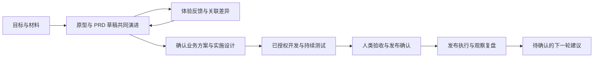

# 29 · 连续协作原型方案与 M2c-3 治理衔接

> R1 确认更新：用户已对 `b0ff6eb` 交付中的第九节 R1 包回复“同意”，批准交互语义、14 个源码/测试文件和合成验证/清理范围。实现与 12 条门禁已完成，当前为原型交互 LOCAL_VERIFIED，视觉/业务评审待完成；结果见 [30 号](30-连续协作原型实施与验收-20260912.md)。下方待确认措辞保留为方案形成时记录；治理原方案、数据库测试包和 main 合并未随 R1 获批。

> 原方案轮状态（历史）：docs-only / DESIGN_PROPOSED。第九节 R1 后续已确认并完成本地原型验证，见 30；以下保留当时的设计过程，治理部分仍待确认。M2c-2 已验收并合并推送 main（a9eec73）。29 号初稿交付后，用户进一步要求采用 AI 原生协作方式、各阶段高效完成并无缝衔接；本次在同一方案分支补充产品要求与验收设计。下文具体方案、行为差异及测试包尚未获批准，不开始实施或业务 PG 启用。

## 本轮改动（文件级清单）

基线 `a9eec73ed65610f09a80f11331edbda1b4252a67`，已 fetch 并核对 main/origin/main 一致、开工工作区干净。方案分支 `feat/m2c-governance-plan`，按 23 号开工/收工提交与 feature 推送；main 合并留待评审。

本轮仅允许以下 6 个 Markdown，内容为方案、事实、差异、当前入口与任务参数：

1. `AGENTS.md`
2. `docs/planning/prototype-v3/19-开发路线图-20260912.md`
3. `docs/planning/prototype-v3/20-Codex交接提示词-20260912.md`
4. `docs/planning/prototype-v3/29-M2c-3治理与项目方案及范围确认-20260912.md`
5. `docs/planning/prototype-v3/README.md`
6. `output/pfc-workbench-prototype/README.md`

父级 POD-PFC-001 / 原型 M2 / M2c-3；本轮尚未实施、集成、验收或发布新能力，正式 CAP/Unit 状态不变。唯一 POD next route 保持 `POD-PFC-001/M2/R3a/artifact-collaboration-tdd`。M2c-2 的业务 PG 启用是 28 号独立事项，不作为本次文档方案的隐含授权。

计划：核对原型动作/13 号契约/当前 PG → 比较方案并提出推荐 → 写清角色与快照规则、文件白名单、数据与验收设计 → 文档和差异检查 → feature 收工交付供确认。没有并行代理、安装、数据库操作或常驻 helper。

## 验证结果（命令 + 输出摘要 + 证据路径）

已读 AGENTS、19/20/21/23/25/28、交接 README、12/13 及质量配置和相关源码。固定 Node 24.20.0 / npm 11.19.0，根及 server `npm ls --depth=0 --offline` 退出 0；`npm run test:gate:quick -- --dry-run` 为 READY_TO_RUN，只证明计划就绪。

方案轮采用 fullstack-quality-gate 的影响/验证映射。没有源码行为改动，因此不新增测试程序或重跑有数据写入的 13 闸；在收工前核对配置、交付台账、文档链接/路径和 Git 范围，实际结果补入末节。本轮不把 M2c-2 的 13 闸当作 M2c-3 通过证据。

## 与交接包的差异（超范围项必须列出）

保留 25 号 M2c-3 的能力目录、绑定、成员、项目、知识、审计和预算范围，补齐原型与 13 号之间的缺口。新增/停用成员、实时权限、项目 repo/需求关联、会话覆盖和审计导出为本次需要确认的具体契约；详见第四节。12/13 原文不改，29 号只有获批后才成为该轮增补依据。

测试用例/缺陷、产品验收、观察及 CAP/Unit 编辑仍是必须补齐的产品能力。本方案没有把它们计入 M2c-3 已交付，也没有默默移入 M3。建议在 M2c-3 收工后、M2c-4 开工前单独确认其契约和轮次；确认前 M2c 总体不得标为完成。

## 诚实边界（模拟/未做/待确认）

本轮只准备文档。真实 Shell/Codex/Zed/LLM/CI、SSO、业务 schema、发布、旧数据导入及正式 CAP/Unit 交付均未执行。接口、SQL、原型源码和历史证据不变。

## 下一步（下轮任务参数建议）

连续协作交互规格与下一步原型范围见第九节。推荐先确认 R1：在现有 `index.html` 的本地演练场景走通交互并取得视觉/业务反馈，再修订 M2c-3 与后续持久化契约。R1 尚未获批，第五节治理候选的 62 项文件及数据库测试包也继续待评审，二者不能互相代替授权。确认后才从最新 main 建立对应 feature 分支；若选择 R1，则 30 号用于连续协作原型实施记录，后续治理实施文档顺延，不能预写为 M2c-3 已实施。当前方案分支只提交推送文档，main 合并另按差异评审。

## 最新产品要求：阶段内高效完成，阶段间无缝衔接

### 用户要求与本次方案边界

2026-09-12，用户连续提出业务需求还缺原型设计、原型应早于 PRD 草稿或与其同步、“不能按传统的思路来”，并明确“各个阶段必须高效完成，并阶段之间无缝衔接”。这些是本次方案必须满足的产品要求。以下为据此提出的交互、衔接和验收设计，具体自动化策略、接口和数据模型仍需方案确认。

当前平台自身的 `index.html` 是已有交互基线；为用户的每个业务需求生成、预览、评审和版本化原型是另一项产品能力。[能力目录](../../../output/pfc-workbench-prototype/original/data.js) 有 PRD 生成、方案设计及八阶段绑定，[领域模板](../../../server/src/domain/templates.js) 仍以文本字段生成草稿。这些事实不能证明业务原型或全阶段自动衔接已经实现；历史产品方案虽提到原型产物，也不构成已交付证据。

### 连续协作方式

1. **从意图快速得到可评审结果。** 用户用一句目标、材料或参考界面发起需求。对于有界面的需求，AI 在最少必要澄清后先给可交互候选，PRD 草稿与规则说明可同步形成；不以完整 PRD 为原型生成的固定前置条件。候选明确列出假设、模拟数据和未接通能力。纯接口、后台任务等需求采用请求样例、流程或运行示例，不强制制造页面。
2. **在同一个需求工作区持续推进。** 对话、材料、原型、PRD、方案、代码和验证证据保留同一需求身份与版本关联。切换阶段自动带入适用的已确认事实、原始材料引用和待决问题，用户无需重新上传、复制文档或复述已确认结论。AI 使用与当前任务相关的上下文摘要，并能回查原始依据，避免每步重读全部历史。
3. **各类成果共同演进。** 用户在原型或对话中修改规则时，AI提出关联 PRD、原型、技术约束和验收项的增量修改及影响说明；受影响结果待验证或确认后再成为新基线。文档按需展开、导出，不为每次小改动重生成全套材料。AI 推断、实现细节、用户确认事实分别标识，生成结果不能自行变成业务决定。
4. **让 AI 持续完成已授权工作。** 阶段入口给出本阶段目标、可用输入、推荐下一动作和阻塞原因；提前检查工具、权限、依赖和预算。已确认范围内可连续执行、复用成果、准备后续草稿；仅对影响结果的缺失信息或需要新增授权的动作集中提出明确问题。已有授权继续有效时不重复索取；新目标、范围或外部效果不能沿用旧批准。
5. **阶段完成即准备好下一步。** 系统根据当前版本的退出条件校验成果与证据，组装下一阶段输入，并展示承接摘要、下一动作与剩余阻塞。条件满足且已有授权时衔接可执行动作；需要人类确认时保留完整上下文，确认后直接续办。对未阻塞的准备工作可继续推进，正式阶段完成与生产操作仍遵守各自门禁。
6. **变更与中断可恢复。** 上游变化只使有依赖的下游成果、计划或证据待复核，展示原因和增量修复建议；保留未受影响结果。刷新、断线或进程重启后从已持久化检查点读回任务，重复点击不得产生重复执行。执行结果不明先核验，不能用盲目重跑制造第二次副作用。

“无缝衔接”的承接内容由系统维护：目标与范围、事实来源和版本、已确认决定、可用产物、验收证据、未决项、当前授权边界和下一动作。它们按需展现在现有对话/画布/证据区域；不增加一张要求用户重复填写的交接表。八个阶段用于展示进度、责任和退出条件，支持草稿协同演进；设计确认、验证、业务验收和发布批准仍有独立依据。

### 每阶段怎样高效完成并承接

以下是目标行为和退出依据，尚未作为当前系统的验收结果。

| 阶段 | AI 在阶段内完成的有效工作 | 交给下一阶段的可用结果 |
| --- | --- | --- |
| 想法 | 提炼目标/范围、复用材料，形成最小体验候选与关键假设 | 有来源的需求意图、候选和真正影响选择的待决项 |
| 需求 | 结合体验反馈同步完善原型、PRD 草稿、规则和验收项 | 经确认的业务规则与范围、对应原型版本、验收标准和已知限制 |
| 设计 | 在原型和需求演进中提前识别技术约束，完成必要可行性验证与方案比较 | 用户确认的实施基线、原型交互、接口/数据约束、测试与回退设计 |
| 开发 | 在确认范围内实现、增量自检，复用已验证原型代码中适合生产的部分 | 指向具体代码版本的可运行成果、改动说明和开发验证证据 |
| 测试 | 按验收项与变更影响执行测试，缺陷与修复结果相互关联 | 对应版本的实测报告、缺陷状态、未覆盖风险和清理结果 |
| 验收 | 自动准备体验入口、差异和证据，聚合需要人类判断的问题 | 验收人对具体版本的接受/退回结论、限制和待办；不以测试通过代签 |
| 发布 | 准备制品、目标、回退与检查项，在已获批准的发布范围执行 | 真实发布版本、环境、执行结果和观察任务；模拟须明确标识 |
| 观察复盘 | 关联运行指标、用户反馈和缺陷，检验目标并提出后续建议 | 有依据的复盘、知识候选与下一需求建议，确认后进入下一轮 |

### 可验收场景与效率指标

统一使用独立的合成需求和可追溯版本验证以下场景；业务验收人为陈立。当前仅完成场景设计，自动化状态为未实施/未执行；具体工厂、隔离范围和测试入口随对应实施方案确认。

| 编号 | 验证动作 | 必须观察到的结果 |
| --- | --- | --- |
| F01 快速形成候选 | 输入目标与参考材料，在未形成完整 PRD 时发起候选 | 可交互结果与规则草稿有来源、版本和假设标识；能据此反馈，生成空壳不算完成 |
| F02 连续承接 | 完成当前阶段所需确认，进入下一阶段 | 同一需求的材料、决定和产物版本自动承接，手工搬运/重复上传次数为 0，推荐动作可直接继续 |
| F03 增量一致 | 修改候选中的一条业务规则并确认该变化 | 原型、PRD、验收项及受影响计划显示差异与依赖；旧证据不冒充新版本通过，无关成果保留 |
| F04 必要决策 | 设置一个阻塞问题和一项已获授权的独立工作 | 问题集中展示原因和可选处理，独立工作继续；同一有效授权不反复询问，越权动作仍阻断 |
| F05 中断恢复 | 在运行/阶段承接时刷新、断线重连并重复提交 | 从服务端读回事实、草稿和运行位置，无结果丢失或重复执行；未知结果先核验 |
| F06 旧基线与权限变化 | 两窗口基于不同版本推进，或推进前撤销权限 | 旧请求明确冲突/拒绝，当前成果不被覆盖，阶段不能假成功；刷新后可看到准确阻塞 |
| F07 完成证据 | 使用只有文档或模拟输出、缺关键证据的候选申请完成 | 明确缺口与下一动作，开发/测试/验收/发布状态不被一次生成动作自动全部标为完成 |

效率度量分开记录阶段内有效执行时间、人类决策等待、外部依赖等待，以及“条件就绪→下一阶段首个有效动作”的衔接耗时；同时记录重复提问、手工搬运、重复计算、返工、首次验证通过率及模型/工具成本。承接场景以零手工搬运、零状态丢失、零重复副作用为确定性验收要求；时延、吞吐和成本目标先采样再与用户确认，不虚构“秒级完成”或提效百分比。执行需有并发、重试、超时、取消和成本上限；达到上限给出可继续处理的状态，不能无限后台重试。

### 与 M2c-3 的关系及待补设计

M2c-3 的成员权限、能力绑定、项目上下文、知识引用和预算来源可以支撑上述协作，但现有方案尚不覆盖业务原型产物、跨产物依赖、全阶段承接与恢复协议。它们作为明确的产品缺口保留，不能仅凭治理接口完成宣称已解决，也不自行归入 M3/M4 或提高正式 CAP/Unit 状态。

后续实施方案应先提供现有原型上的可评审交互范围：意图生成候选、原型反馈同步 PRD、阶段承接摘要、集中待决、中断恢复、上游变更影响，以及 M2c-3 的权限/配置冲突状态。需明确是否与 M2c-3 同轮、哪些文件和契约受影响、持久化与浏览器验收路径，再取得相应确认。本次只补充六文档内的要求与场景，不修改 HTML/JS、API、SQL 或 12/13 号契约。

## 一、事实、目标与方案选择

目标是让现有治理中心和项目入口使用服务器保存的真实本地领域数据，并让这些配置正确约束后续模拟作业。页面布局沿用原版，技术栈仍为原生 JS / Express / pg / ws。

| 当前代码事实 | 影响 |
| --- | --- |
| [路由入口](../../../server/src/index.js) 未注册 caps/bindings/members/projects/knowledge/audit/budgets；[健康声明](../../../server/src/runtime.js) 明确它们未接入 | 不能只取消按钮禁用；需要仓储、服务、路由、回读与失败态一起落地 |
| [治理动作](../../../output/pfc-workbench-prototype/original/governance-actions.js) 直接改 P.s；成员以名称定位，移除只删数组项 | 名称不能继续作为可变授权主键；停用、历史责任和并发规则需要明确 |
| [HTTP 鉴权](../../../server/src/auth.js) 与 [WebSocket](../../../server/src/ws.js) 按启动配置匹配 name/tenant/role | 只保存 members 表不会使旧 token 或已连接 WS 的权限变化生效 |
| [需求 DTO](../../../server/src/domain/dto.js) 的 projectId 固定为空；[项目表单](../../../output/pfc-workbench-prototype/original/actions.js) 保存 repo 并直接改 req.projectId | 登记、回读、关联与计划基线需要同时接入，不能丢 repo 或把登记当成扫描过目录 |
| [计划仓储](../../../server/src/persistence/runs.js) 当前基线只含阶段、材料修订和产物版本 | 新增项目与能力后必须保存具体上下文快照，明确哪些后续配置变化会阻断启动 |
| [PG 前端映射](../../../output/pfc-workbench-prototype/original/domain-view.js) 把治理集合初始化为空、overrides/knowledgeRefs 清空 | 新领域不能依赖旧浏览器树恢复，须以领域 GET 回读，并保留视图/草稿 |
| [治理页面](../../../output/pfc-workbench-prototype/original/governance.js) 有固定的“陈立”“企业 SSO 已登录”展示；PG 作业 DTO 的 budget/spent 为 0 | 新 PG 页面需显示当前真实本地身份与预算来源，不沿用演示身份或将占位数字当计费 |
| 迁移注册只支持 001/002；源码有约 985 行的 execution-service.js | 新增 003，保护旧迁移校验和；抽出本轮涉及的计划策略，避免继续堆叠 |

| 路径 | 收益 | 代价及退出条件 |
| --- | --- | --- |
| **A，推荐：完成 M2c-3 的治理/项目闭环，以四个内部检查点推进** | 一轮把身份、配置、上下文与 UI 回读连通，符合 25 号既定范围 | 需要确认下文策略；四个检查点全部通过才交付，不用单点 PASS 宣称整轮完成 |
| B：本轮只做成员/项目，能力/绑定/知识另开子轮 | 单轮改动较小 | M2c-3 继续未完成，需要另填后续方案和测试包；若选择 B，先收窄本文白名单再实施 |

日常业务 PG 启用不是 A 的前置条件：开发仍在可销毁 schema 验证。28 号的空业务库/账号选择不在此轮代填。推荐 A 尚未被当作用户选择。

## 二、六项待确认决策

### D1 成员身份与权限

- 成员新增数据库 UUID + 对外 `MEM-*`，保留 name 作为当前本地登录名，同租户唯一，暂不提供改名。只允许为忽略配置中已存在的本地账号登记团队成员，登记不会创建操作系统账号、发出邀请或配置 SSO。
- 003 的显式成员初始化工具从已确认账号配置导入初始成员；仅用于工厂或另行批准的业务初始化，应用启动不插入成员。初始化遇到已有成员仅核对身份，不能按配置中的旧 role 覆盖后来在数据库修改的角色或复活已停用成员。
- PG 请求的 tenant/name 来自签名 token 和本地账号允许名单；角色/active 状态以数据库为准。HTTP、auth/me、WS 建连及后续消息/推送重新校验，不能信任 token 内的旧 role、body.role 或页面角色体验开关。数据库故障时拒绝请求，不回退配置角色。
- “移除”采用软停用，保留历史成员、审计、需求负责人文本与已完成作业；没有真实邮件通知或自动替人改派。当前 PG 尚无 Unit/观察负责人写模型，不制造“已改派”记录；以后接入时按稳定成员身份补齐责任关系。
- 最后一个 active owner 不得降权或停用，以租户级锁保护并发；不硬编码“陈立不能删除”。事务中的人类写命令在读取收据之前重验成员权限，锁顺序固定为租户权限锁→命令收据锁→业务实体锁，与角色变更一致；角色变更提交后不能再提交旧权限的新操作。
- 已启动的模拟作业保留其原计划与已产生事实，降权不自动伪造取消/失败；该成员不得继续发起、批准或控制新动作。服务端模拟和已认证 sim-bridge 的结果回执属于受控内部来源，不能因为旧发起人降权而丢结果，也不能允许客户端伪造内部来源绕过权限。

本轮仍是 loopback 开发登录，知道允许名单中的账号名即可选择该开发身份，不是生产认证或多用户安全边界；SSO/真实身份验证继续属于 M3。新增的是该已声明开发身份下的权限与状态一致性。

### D2 能力与绑定快照

- 能力登记后为“待复核、停用”；复核通过后仍需显式启用。同租户 name+ver 唯一，同一版本内容不可原位更改，升级登记新版本。类型限定现有 Skill/MCP/ACP/终端工具，protocol 从类型校验映射，endpoint 只作元数据保存，绝不执行命令、联网探测或安装插件。
- 阶段默认绑定只允许同租户、已复核且启用的能力，保存完整 capIds 集合并核对 revision，避免两个窗口互相覆盖。每阶段最多 100 项；每项 name/ver/endpoint/desc 分别最多 80/100/2048/4000 字符。不得把凭据放进 endpoint，拒绝 URL 用户信息和明确凭据字段，日志仅留能力编号与字段变更摘要。
- 补齐原型“本需求本阶段覆盖 / 恢复默认”：数据库保存 enabled/disabled 覆盖，缺省表示跟随团队默认。覆盖不能重新启用团队停用能力，不改正式业务 CAP/Unit。
- 创建计划时冻结能力 ID/版本/指纹、默认绑定与覆盖版本，以及项目上下文；已有计划和运行历史不随团队默认绑定变化改写。默认绑定/会话覆盖调整只影响新计划。
- 能力停用后，从后续有效集合排除；旧待启动计划如果引用已停用能力，启动返回明确阻断，重新发起计划并审批。正在运行的模拟作业不被该配置动作暗中改终态。空能力集合允许纯服务端模拟，并显示“未调用已登记工具”，不得以空集冒充真实工具执行。
- 已批准但尚未启动的作业还需核对审批人的当前有效批准权限；审批人已停用/降权则阻断启动，不沿用旧权限放行。

### D3 项目登记与需求关联

- 保留表单 name/path/repo/branch/tech/source，path 只做绝对路径等格式校验，repo 允许空且不能含凭据；不读取目录、Git、依赖或文件数量。UI 显示“已登记，未扫描”，文件数未知为“未扫描”，不填 0 或 fabricated 扫描结果。
- 项目新增 `PRJ-*` 业务号、UUID 和 revision；项目详情独立可读。本轮没有项目删除/改路径界面，避免未经讨论改动已引用上下文。
- 创建需求可关联合法的同租户项目；既有需求用带 expectedRevision 的关联接口。本轮允许首次关联/换绑，不新增解绑功能。存在 `WAITING_APPROVAL / RUNNING / CANCELLING / UNKNOWN` 作业时拒绝换绑，提示先取消或核验；不得自动取消运行。
- 换绑后保留原产物历史，但把既有阶段产物标为 stale，增加需求 revision，并在同一事务记录关联变化与审计/事件。后续需在当前阶段基于新项目补新版本并确认，旧审批不能覆盖新上下文。
- 新作业计划冻结项目编号、路径、repo、branch 和 revision，仅用于上下文与审阅；真实目录授权、范围执行和 Git 操作仍待 M4 Bridge。

### D4 知识登记与引用

- owner/executor 可登记 title/type/content/tags，viewer 只读；沿用现有五种类型。title≤160、content≤32000、tags≤20 且每项≤40 字符；新增 `KN-*` 编号，暂不加编辑/删除或向量扩展。
- 列表支持 type/q 和稳定分页，正文按文本转义，不执行 HTML。新需求创建时在同租户标题/标签与 name/goal/scope 做字面包含匹配，稳定排序最多取 3 项；明确标为关键词匹配，不声称语义召回。
- 命中关系、条目版本及当时引用摘要在创建需求事务内保存，GET req 恢复 knowledgeRefs 与来源说明；无命中为真实空集合。先展示引用，不把知识自动当作已确认产物。
- 复盘自动沉淀依赖观察域，目前不在 PG 伪造复盘结果；以后由已确认的观察动作调用该知识登记服务。

### D5 审计与预算

- 所有本轮业务写命令与审计/事件/幂等收据同事务；失败/回滚不能留下成功审计，actor 来自服务端上下文。新增实体需记录其类型、编号及变更摘要，不把知识全文、token、endpoint 凭据或文件原件复制到审计。
- 团队审计列表与 CSV 导出仅 owner；按 actor/action 分页过滤，排序采用 createdAt+id。导出保持同一过滤条件与导出时点，只导出一致快照，最多 10,000 条/5 MiB；超限要求缩小过滤范围，不静默截断。导出返回后浏览器下载，CSV 转义并处理公式注入，下载失败要可见。导出访问审计记录本次 requestId、过滤摘要和响应生成条数，不声称客户端已经保存；它不属于可重放的业务修改命令。
- `/api/budgets/me` 仅查询：无预算配置返回 configured=false、quota/used/remaining=null、source=unconfigured。模拟用量与真实计费分开标识；本轮不新增充值、调预算、真实扣费或超预算真实工具调用。
- 预算表仅供已确认配置或合成工厂写入；无后台“默认 8000”或定时伪扣费。保留 25 号的预算读取范围，计量/扣减/耗尽策略在真实调用接入前另行确认。

### D6 剩余范围与日常启用

本轮不含发布/CI、SSO、向量检索、真实工具或扫描，也不含尚缺契约的测试用例/缺陷、产品验收、观察、CAP/Unit 编辑。这些能力继续显示未接入；全平台“生产级”退出条件仍未满足。建议 M2c-3 交付时必须给出上述剩余能力的单独补齐方案，再评审 M2c-4 发布链路，不能从子轮验收跳到 M2c 全部完成。

003 之后的日常启用需要更新 28 号的迁移/成员初始化包，并重新只读预检、确认租户与账号。批准本方案不包含这个业务操作。

## 三、架构、数据与实施检查点

复用现有 Express 路由→职责服务→pg 仓储→事务/收据/事件模式。新增治理按成员、能力/绑定、项目、知识和审计预算分别组织；共享授权放 membership-policy，计划冻结与启动前校验放 execution-plan-policy，不能在 route、ws 或大前端 action 中直接写 SQL。

只新增 `003-governance-projects.sql`，001/002 字节及 UTF-8/LF checksum 不变。003 新增以下领域结构，不使用整树 app_state：

| 表或增补 | 必要字段/约束 |
| --- | --- |
| members | tenant_id、id/public_id、name、role、active、revision、created_at/disabled_at；租户+name 与租户+public_id 唯一；role 枚举；最后 owner 由事务锁保护 |
| caps | tenant/id/public_id、name/type/protocol/endpoint/src/ver/desc、fingerprint、reviewed_by/at、enabled、revision；name+ver 租户内唯一 |
| binding_sets / cap_bindings | 每租户每阶段一条集合 revision；集合+cap 唯一，组合外键验证租户；显式绑定最多 100 项 |
| req_cap_overrides | tenant/req/stage/cap/enabled；唯一组合及跨租户外键；覆盖修改由 req.revision 校验并递增，不标旧产物 stale、不改写旧计划 |
| projects / reqs.project_id | 项目 name/path/repo/branch/tech/source、revision、loaded_by/at；reqs 增加 tenant+project 外键，已有需求保持 null |
| knowledge / knowledge_links | title/type/content/tags/version/created_by/at；req+knowledge 唯一引用，保存条目版本、匹配原因和有界摘要 |
| budget_accounts | tenant/period/quota/used/source/revision；非负且 used≤quota，来源明确；无配置不创建默认额度 |
| run_plans 增补 | context_snapshot 与 snapshot_version，保存单计划的项目/能力元数据；历史已完成计划保留原结果；缺少新版快照的未启动计划返回 STALE_PLAN，要求重新发起 |
| audit_logs / id_counters 增补 | 审计可记录无 req_id 的治理实体类型/编号；扩展实体编号枚举，不能重置旧计数器 |

所有业务外键使用 tenant_id+UUID，所有对外标识用既有分配器产生，不以数组长度或客户端编号写库。必要索引覆盖租户、状态、阶段、排序和引用，不安装 pgvector/其他扩展。

003 的 API 启动期要求已显式迁移且至少有一个配置允许的 active owner 成员；缺迁移/成员初始化失败即拒绝启动，不自动 DDL、seed 或回退。新 runtime 使用 003，旧 001 组件回归保留原版本；已有 M2c-2 runtime 测试工厂先验证 001→002 的原断言，再显式迁移 003/初始化合成成员后启动服务，不能删去旧校验来消除失败。若执行前发现日常业务库已被另行启用，停止受影响阶段并对齐迁移包。

| 检查点 | 本轮顺序和可核验结果 |
| --- | --- |
| C1 成员/授权与 003 | 先写失败用例，再做迁移/仓储/显式初始化、HTTP/WS 实时角色与最后 owner 保护；工程检查点不等于业务验收 |
| C2 能力/默认与会话绑定 | 登记→复核→启用→绑定→新计划快照→停用阻断未启动计划；元数据登记没有外部效果 |
| C3 项目/知识/审计预算/UI | 登记→关联→知识匹配→独立 GET/SQL/重启回读；接入原界面的空/加载/错误/冲突/无权限状态 |
| C4 全回归与差异评审 | 旧 13 闸和新增专项、PC 三宽度、清理读回、源码指纹、逐文件差异；陈立评审后才可合并 |

所有步骤由 Codex 串行实施和集成，无并行代理。PG 池继续最多 2 连接、沿用有界连接/SQL 超时；列表默认 20、最大 100，offset 为非负整数且上限 10,000，超限明确拒绝。仅本轮受影响列表增加分页控件，过滤/切页不丢草稿，失败后不显示成功 Toast、不写本地假事实；权限失效时保留未提交草稿并要求重新读取身份。WS 失效连接停止收取后续事件并关闭，错误有界且不循环重试打满连接池。

## 四、接口增补与权限矩阵（待确认）

沿用 13 号 JSON 包装、错误结构与 offset/limit。写命令一律 commandId；修改已有对象还要 expectedRevision，GET 返回当前 revision。重复同命令返回同一受权结果；同 key 不同载荷返回 COMMAND_CONFLICT，失去权限后不能通过旧收据重放读取受限结果。

cap-overrides 的 expectedRevision 是需求 revision；bindings 是该阶段 binding_set revision；其他修改取目标对象的 revision。新默认绑定/覆盖不纳入旧计划的动态基线重算，旧计划仅按自身冻结快照及当前硬门复核。审计导出的访问记录用 requestId 追踪，不复用业务写收据。

| 接口 | 13 号关系与确定的候选语义 |
| --- | --- |
| GET/POST `/api/caps` | 已列；GET 返回 items/total，支持 pending/q；POST 校验七字段，返回 cap |
| POST `/api/caps/:id/review`；PATCH `/api/caps/:id/toggle` | 已列；增加 revision/幂等保护，toggle 必须显式 enabled，不做服务端盲翻转 |
| GET/PUT `/api/bindings` | 已列；GET 返回阶段集合及 revision；PUT `{stage,capIds,expectedRevision,commandId}` 原子替换一阶段 |
| GET/PUT `/api/reqs/:id/cap-overrides` | **补充**现有会话动作；PUT `{stage,overrides:[{capId,enabled}],expectedRevision,commandId}`，空数组表示该阶段恢复默认；GET 返回覆盖与 effectiveCaps |
| GET `/api/members`；PATCH `/api/members/:uid/role` | 已列；uid 为 MEM-*；GET 返回 items/total，包括角色/active/revision |
| POST `/api/members`；DELETE `/api/members/:uid` | **补充**登记与停用；POST `{name,role,commandId}` 且账号须在本地允许名单；DELETE 携带 expectedRevision/commandId，返回已停用 member，不物理删除 |
| GET/POST `/api/projects`；GET `/api/projects/:id` | 列表/创建已列，详情为**补充**；创建增加 repo?，tech 为去重文本数组，返回 project；不扫描 path |
| PATCH `/api/reqs/:id/project` | **补充** `{projectId,expectedRevision,commandId}`，存在活跃作业拒绝；成功返回 req，旧产物 stale；不提供解绑 |
| GET/POST `/api/knowledge` | 已列；GET 支持 type/q，POST 四字段限制见 D4，返回 knowledge；创建需求响应 knowledgeRefs 与详情一致 |
| GET `/api/audit`；GET `/api/audit/export` | 列表已列；导出为**补充**，参数与过滤相同，返回有界 CSV 下载；快照时间、条数及导出审计可核对 |
| GET `/api/budgets/me` | 已列；返回 budget 的 configured/period/quota/used/remaining/source；缺配置各数字为空，无写端点 |
| GET `/api/auth/me`、POST `/api/auth/dev-login`、`/ws/web` | 路径不改；003 从当前 active 成员解析权限，body.role 无效，停用/降权不等 token 过期才生效 |
| 原需求/运行/计划 GET 与 POST | 增补 project/knowledgeRefs/overrides/effectiveCaps/计划快照；严格沿用已确认版本/阶段/取消与 UNKNOWN 规则，不改真实执行范围 |

| 动作 | owner | executor | viewer / 停用成员 / bridge |
| --- | --- | --- | --- |
| 成员、能力、团队默认绑定配置 | 可写 | 只读 | viewer 只读；停用拒绝；bridge 拒绝 |
| 项目登记/需求关联、知识登记、当前需求阶段覆盖 | 可写 | 可写 | viewer 只读；停用/bridge 拒绝 |
| 团队审计列表/导出 | 可读/导出 | 拒绝 | 拒绝 |
| 预算/项目/能力/知识查询 | 可读 | 可读 | viewer 可读；停用/bridge 拒绝 |
| 既有作业批准/控制 | 保留当前权限 | 保留当前权限 | viewer 拒绝；内部模拟回执走独立已认证通道 |

新错误至少包括 MEMBER_INACTIVE、LAST_OWNER_REQUIRED、MEMBER_NOT_CONFIGURED、CAP_NOT_REVIEWED、CAP_DISABLED、PROJECT_CHANGE_BLOCKED、PLAN_APPROVER_FORBIDDEN、EXPORT_LIMIT_EXCEEDED。通用 400/401/403/404/409/503 及 REVISION_CONFLICT 保持；跨租户实体读取不泄露存在性。确认后在代码契约清单和 30 号记录精确 DTO，不直接修改历史 12/13。

## 五、候选实施白名单（只有确认后生效）

下列源码为下一轮候选；本轮只改开头六个文档。每个路径均有具体职责，不能按父目录扩权。新文件名以本表为准；出现必要但未列出的文件，先解释原因并对齐。

| 文件 | 目的 |
| --- | --- |
| `server/sql/m2c/003-governance-projects.sql` | 新表/索引/外键/计划与审计字段；001/002 不变 |
| `server/src/persistence/migrations.js` | 003 注册、就绪与表/字段/约束检查；001/002 原 checksum 和旧路径保留 |
| `server/src/persistence/members.js`、`server/src/persistence/caps.js`、`server/src/persistence/bindings.js`、`server/src/persistence/projects.js`、`server/src/persistence/knowledge.js`、`server/src/persistence/governance-read.js` | 各自仓储；最后一份负责审计和预算查询，不混入路由 |
| `server/src/persistence/identifiers.js`、`server/src/persistence/commands.js`、`server/src/persistence/requirements.js`、`server/src/persistence/runs.js` | 新编号、人类命令事务内重验权限、项目/知识与计划快照 |
| `server/src/domain/membership-policy.js`、`server/src/domain/member-service.js`、`server/src/domain/capability-service.js`、`server/src/domain/project-service.js`、`server/src/domain/knowledge-service.js`、`server/src/domain/governance-read-service.js` | 当前权限、领域校验与 DTO；服务只通过仓储写入其他域 |
| `server/src/domain/execution-plan-policy.js` | 从 execution-service 抽出本次涉及的计划快照/审批人/能力校验职责，架构专项保护 |
| `server/src/domain/execution-service.js`、`server/src/domain/requirement-service.js`、`server/src/domain/dto.js`、`server/src/domain/events.js` | 委托计划策略、关联/引用回读、事务后治理与权限事件；不重写全部执行状态机 |
| `server/src/routes/caps.js`、`server/src/routes/bindings.js`、`server/src/routes/members.js`、`server/src/routes/projects.js`、`server/src/routes/knowledge.js`、`server/src/routes/governance-read.js` | 新端点传输校验和调用，不直接访问 Map/SQL |
| `server/src/routes/reqs.js`、`server/src/routes/auth.js` | 关联/覆盖与成员身份解析的既有接口衔接 |
| `server/src/auth.js`、`server/src/access.js`、`server/src/runtime.js`、`server/src/index.js`、`server/src/ws.js`、`server/src/contract.js` | 当前成员授权、003 就绪和精确能力声明、挂载、WS 失效与契约登记 |
| `server/scripts/migrate-m2c.mjs`、`server/scripts/initialize-m2c-members.mjs` | 显式 003 迁移与显式成员初始化；业务执行不在本轮授权 |
| `server/.env.example` | 仅配置键/安全示例与初始化说明，无凭据 |
| `output/pfc-workbench-prototype/original/governance-domain.js`、`output/pfc-workbench-prototype/original/governance-domain-view.js` | 新 PG 治理命令和回读/分页适配；不把多域积累进原有大 action 文件 |
| `output/pfc-workbench-prototype/original/governance-actions.js`、`output/pfc-workbench-prototype/original/governance.js`、`output/pfc-workbench-prototype/original/actions.js`、`output/pfc-workbench-prototype/original/spaces.js`、`output/pfc-workbench-prototype/original/workbench.js` | 仅相关入口/表单字段/项目上下文与计划快照展示，沿用现有样式和组件 |
| `output/pfc-workbench-prototype/original/domain-actions.js`、`output/pfc-workbench-prototype/original/domain-view.js`、`output/pfc-workbench-prototype/original/api-client.js`、`output/pfc-workbench-prototype/original/ws-client.js` | 新动作委托、回读/权限刷新/错误草稿、端点清单与失效事件；local/mock 保持 |
| `output/pfc-workbench-prototype/index.html`、`output/pfc-workbench-prototype/verify-static.mjs` | 登记两个新 JS 的加载顺序及静态覆盖，不换原型 |
| `server/test-data/m2c-governance-fixture.mjs`、`server/verify-m2c-governance.mjs`、`output/pfc-workbench-prototype/verify-m2c-governance-browser.mjs` | 新确定性工厂及 PG/权限/浏览器专项 |
| `server/test-data/m2c-domain-fixture.mjs`、`server/verify-m2c-domain.mjs`、`server/verify-m2c-architecture.mjs`、`output/pfc-workbench-prototype/verify-m2c-browser.mjs` | 旧组件 001/002 原断言、新 runtime 003 和仍未接入动作的准确断言，不能删除老回归风险覆盖 |
| 开头六文档；`docs/planning/prototype-v3/30-M2c-3实施与验收-20260912.md` | 确认/执行/差异/人工验收记录与当前入口 |
| `docs/quality-gate/reports/m2c-3-governance-20260912.md` 及同名目录 | 合成原文/PC 截图/SQL/清理/指纹/差异；证据目录不放配置、真实 endpoint 或用户资料 |

不在名单内的历史回归脚本可以执行但不可改。禁止改依赖/锁文件、12/13、001/002、m1-schema.sql、archive、_backup、历史截图/报告、apps/packages、旧工程根脚本/测试、质量配置与正式交付台账。若未来实际开工跨日，先在 30 号把单一日期/runId/目标重新列全并核验，不能扩大为任意 schema 或路径。

## 六、隔离数据与验收设计（待确认授权包）

环境限本机 PostgreSQL 18 / `127.0.0.1:5432` / `pfc_local` / `pfc_app_local`。仅以下三个精确 schema，串行创建/使用/销毁；每次创建前必须不存在，不重用不明残留。

| 用途 | schema 与 runId | 上限与处置 |
| --- | --- | --- |
| 新治理/项目专项及浏览器 | `codex_test_m2c_20260912_governance`；`CODEx_TEST_M2C_20260912_governance` | 每次≤2,000 合成行；专属 `.local/m2c-3-governance-20260912/files/<runId_attempt>/`，≤100 MiB；PG 与浏览器串行、每次清理完再开始 |
| 既有 M2c-2 回归升级就绪层 | `codex_test_m2c_20260912_domain`；`CODEx_TEST_M2C_20260912_domain` | 保留≤2,000 行/100 MiB；原 `.local/m2c-2-domain-20260912/files/<runId_attempt>/`；001/002 前缀验证后才迁移 003 初始化合成成员 |
| 原 001 存储组件回归 | `codex_test_m2c_20260912_storage`；`CODEx_TEST_M2C_20260912_storage` | 保持 001 与≤200 行原界限，不能引入治理数据或扩大清理 |

测试进程的元数据/账号配置放同一任务忽略目录，工厂记录 runId、attempt、schema OID/marker、精确表清单、createdIds 和文件清单。构造两个合成租户，主租户两个 owner、一个 executor、一个 viewer、一个 inactive、一个允许名单中尚未登记成员的账号；另租户 owner，以及受控模拟 bridge。所有名称、知识、路径、repo、endpoint、审计内容均为 CODEx_TEST_ 合成样本，不读取真实目录或发送网络请求。

用固定名称、明确匹配词、可控时钟/版本构造有效与负面数据：合法 MCP 元数据、重复 name+ver、未复核/停用 cap、空/100/101 项绑定、跨租户同 publicId、两个 owner 并发降权、角色变化与旧 token、草稿冲突、带公式前缀 CSV、中文/空知识、活动作业阻断换绑、未配置预算。工厂先验业务有效性，再调用真实 API/仓储产生需验证状态；不能用直接 SQL 构造成功结果替代被测流程。SQL 只用于独立回读、可控故障和测试专属设置。

由工厂 finally 关闭自己启动的 loopback API/模拟 Bridge/Edge context/连接池；核对绝对路径仍在精确文件根、schema OID/marker/归属/表白名单及行数后才能删除，独立 SQL 与文件读回为 0。异常保留脱敏 manifest，先核实归属再恢复清理，禁按前缀批量删除。原 PG 若已运行保留；若未运行，只在本测试包明确批准后临时启动并恢复原态。测试服务按需占用 5189–5196 中事先确认空闲的端口，冲突停止而不杀未知进程。无数据库/角色/扩展级变更，pfc/public/pfc_workbench 及其他 schema 无 DDL/DML。

### 用例与自动化计划

以下都是待实现用例，owner/最终验收人为陈立，Codex 负责执行与证据。每例使用上面的确定性工厂、隔离/清理规则；具体 createdIds 在执行报告记录，当前不填 PASS。

| 场景 / 风险 | 前置、步骤与预期断言 | 自动化 |
| --- | --- | --- |
| G01 迁移、初始化与恢复 | 验证 001/002 前缀原断言→003；重复迁移无改变；坏 checksum/缺表/无 active owner 拒绝启动；重启不重置成员或配置 | PG 专项 |
| G02 登记/改角色/停用 | 允许名单账号新增→GET/SQL→改角色/停用→重启；未知账号拒绝，历史保留，两个 owner 并发降权最多一成功 | PG + 浏览器 |
| G03 即时权限与收据旁路 | 保留旧 JWT/WS，另一 owner 提交降权；旧身份写入/回放受限收据拒绝，WS 后续事件不送达停用成员；DB 失败时不使用配置旧角色 | HTTP/WS + 浏览器 |
| G04 角色撤销与正在运行作业 | 模拟开始→发起人降权→控制拒绝→受控结果正常归档；不能丢结果、伪造取消或把人类请求标为内部来源 | PG/WS |
| G05 能力登记闭环 | 登记→未复核启用失败→复核→显式启用→重复 name+ver 拒绝；endpoint 不联网、不执行，跨租户 ID 不可读写 | PG + 浏览器 |
| G06 绑定与快照 | 两窗口读取同 revision，保存一胜一冲突；阶段覆盖/恢复默认，创建计划后改默认不改变旧快照；停用被引用能力阻断待启动计划 | PG + 浏览器 |
| G07 审批人当前权限 | 批准计划→审批人降权/停用→启动拒绝；重建计划并由有效身份审批后才模拟运行 | PG |
| G08 项目登记/关联 | 保存全部表单字段、repo 可空、无目录扫描；创建需求带 projectId；已有需求换绑活动作业阻断，无活动时 stale 标记/独立读回/旧计划失效 | PG + 浏览器 |
| G09 知识与边界 | 合成标题/标签登记→分页检索→新需求最多 3 个匹配→重启回读同引用；无命中为空；跨租户、脚本内容、超长字段不越权/执行 | PG + 浏览器 |
| G10 审计与导出 | 成功同事务、失败无成功记录；owner 过滤分页与 CSV 一致、公式转义、超限报错、不漏导/截断；viewer/executor 导出拒绝 | PG + 浏览器下载 |
| G11 预算事实 | 缺配置显示未配置及 null；显式合成配置读回正确来源/数值，模拟输出不自动形成真实扣费 | PG + 浏览器 |
| G12 模式/错误与三档 PC | local/mock/旧 memory 回归；PG 空集合、加载、断网/503、409 保留草稿、权限刷新；1280/1440/1920 保留原三栏/密集表/双终端、键盘可用 | 原 13 闸 + 新浏览器 |
| G13 范围和清理 | 白名单/001002 checksum/禁止整树写/SQL职责边界；schema/文件/进程独立读回 0，原业务对象不变 | 架构 + 工厂清理 |

实施先补可稳定失败的上述风险断言，再做最小代码改动。清理/字段边界/并发/权限必须由工厂控制，不通过更长 sleep、去掉断言或改期望为现象来“跑绿”。

### 拟执行入口（不是本轮运行记录）

在仓库根使用固定 Node，前九条 PFC_DB=memory 且 DATABASE_URL 为空；其他真实 PG 用工厂注入精确目标串行运行：

~~~powershell
node output/pfc-workbench-prototype/verify-prototype.mjs
node output/pfc-workbench-prototype/verify-m1-layer.mjs
node output/pfc-workbench-prototype/verify-m1-e2e.mjs
node server/verify-server.mjs
node server/verify-server-m2.mjs
node server/verify-m2b.mjs
node output/pfc-workbench-prototype/verify-m2b2-model.mjs
node server/verify-m2b2-domain.mjs
node output/pfc-workbench-prototype/verify-m2b2-browser.mjs
node server/verify-m2c-pg.mjs
node server/verify-m2c-architecture.mjs
node server/verify-m2c-domain.mjs
node output/pfc-workbench-prototype/verify-m2c-browser.mjs
node server/verify-m2c-governance.mjs
node output/pfc-workbench-prototype/verify-m2c-governance-browser.mjs
~~~

最后两条为待新增；共 15 条候选入口，不能声称已有结果。配置/交付台账、修改源码 node --check、verify-static 和 Git 差异检查也须通过。旧工程 Quick/Core/Full 不由原型闸替代。浏览器沿用现有 Playwright/Edge，覆盖上述真实交互与截图；不新增依赖，移动端不在 PC 项目范围。小规模本地验证不代表生产吞吐、长周期存储或完整跨浏览器兼容。

## 七、退出、回滚、观察与确认

实现退出：15 条入口、G01–G13 场景映射、SQL/HTTP/WS/PC 独立证据、清理与职责检查、逐文件差异齐全，标为 LOCAL_VERIFIED；陈立再评审视觉/业务、工程/测试/安全限制才记本轮原型交付验收。正式 CAP/Unit 不随原型验收升级。任何失败或缺证据如实记录，不以自审代替用户确认。

本轮无部署目标，发布/日常启用、post-release smoke 和观察窗均 NOT_EXECUTED；若提出启用，另交 003 SQL、成员初始化输入、数据库/文件同点备份、owner/端口与回退步骤，再决定 30 分钟观察。重点监控 503/权限拒绝、角色变更后 WS 泄漏、重复执行、事务回滚、UNKNOWN、事件积压、文件缺失和收据/审计增长。出现越权、旧计划误启、不可解释的双写即停止并保留证据。

测试失败只按已授权工厂清理自身对象；不 DROP 业务 schema。代码回退到 a9eec73 不能配新版业务数据库冒充兼容，必须使用对应版本与同一时点数据库/文件快照，且需另行批准。此轮只保存方案开工/收工时间、改动量与自审问题；无虚构交付周期/生产性能或发布后指标。

治理原候选包仍为：**方案 A + D1–D6 + 第五节逐文件范围 + 第六节三类精确 schema/文件上限、必要的临时 PG 启停和清理**。最新阶段协作要求补入后，须先补齐前文所列交互设计并明确轮次关系，再确认最终实施包；本节不能绕过该待办直接开工。批准只覆盖最终列明的范围，不启动日常业务 PG。下一轮开工前再次 fetch、核实当前代码和目标；用户若选 B，则先形成其更小的完整白名单，不能拿 A 的范围只做部分却交付为完整 M2c-3。

确认要求来自仓库 AGENTS 的“Unresolved differences must be aligned with the user before expanding implementation”、显式数据库操作边界，以及用户“有疑问要和我对齐，不能私自决定”；fullstack-quality-gate 在此用于风险/验证映射，没有额外引入一个审批层。

## 八、本轮方案自审与收工验证

开工提交 `0a420ed`。自审已核对成员配置与数据库权限不是同一数据源、项目 repo/关联当前确实缺失、运行基线未含项目/能力、PG 治理按钮仍受禁写，以及 003 会影响现有 runtime 测试工厂。为避免降低老闸，方案明确先保留 001→002 原断言，再升级 003 验证新运行；旧 schema/文件上限不扩张。

本轮实际命令与输出摘要如下；文档链接和候选路径由固定 Node 的只读脚本解析，Git 范围由 PowerShell 对比六个精确路径：

~~~text
node --version -> v24.20.0
npm --version -> 11.19.0
npm ls --depth=0 --offline -> exit 0
npm --prefix server ls --depth=0 --offline -> exit 0
npm run test:gate:quick -- --dry-run -> GATE_STATUS READY_TO_RUN (not PASS)
npm run check:config -> BOOTSTRAP_CONFIG_OK node=24.20.0 policy=fail-closed
npm run check:delivery-governance -> DELIVERY_GOVERNANCE_OK, 5 CAP / 26 Unit / M2
next -> POD-PFC-001/M2/R3a/artifact-collaboration-tdd
DOC_CHECK_PASS -> 6 documents / 78 local links
CANDIDATE_PATH_CHECK_PASS -> 62 explicit candidate files: 34 existing / 28 proposed new
PROPOSAL_SCOPE_PASS -> 6 exact Markdown paths; no source/SQL/dependency/ledger/evidence changes
git diff --check -> exit 0
~~~

候选路径的 62 项不包含开头复用的六文档，也不包含未来证据目录里的具体截图/日志；它们是下轮拟议范围，不能与本轮实际修改的六文档混为一谈。新文件仅在表中列名，尚未创建。

自审修正了两处易误读：会话覆盖明确以 req.revision 防旧窗口覆盖，不把它重新算进旧计划动态基线；CSV 的审计表示响应已生成，不声称客户端下载成功。候选白名单全部使用仓库根相对完整路径，避免同名 auth.js / caps.js 找错目录。

开工提交时间 20:22:16；20:35 完成上述方案检查。没有新增功能测试、失败闸或发布观察结果；文档检查通过不等于设计已确认。尚未编码、连接数据库、运行浏览器或新增常驻进程。日常 PG 的未启用结论沿用刚完成的 28 号交付与本轮零写边界，不声称本轮重新执行了数据库预检。收工按 23 号只提交推送本方案分支，并读回远程 SHA；main 不合并。

### 2026-09-12 用户补充后的文档复核

29 号初稿已在 `4bbeeca35fba829f1356254ba7bdb08b95a29e61` 提交推送。本次为同一方案轮的 docs-only 修订，继续使用原开工记录和六文档白名单：29 增加产品要求、八阶段承接与 F01–F07 场景，并修正下一步；AGENTS/19/20/两处 README 同步入口。没有新建实施轮或扩展第五节候选源码白名单。

复核重点：将用户提出的产品要求与尚待确认的具体实现区分；原型允许先行、PRD 同步演进，阶段仍各有证据；阶段内授权连续有效时避免重复询问，新增业务选择仍需对齐；明确跨产物同步及全阶段恢复尚未实现，没有把完成治理接口当作完成这些能力。

本次实际验证：

~~~text
git fetch origin -> FAIL: Failure when receiving data from the peer
git -c http.connectTimeout=15 -c http.lowSpeedLimit=1 -c http.lowSpeedTime=30 fetch origin main feat/m2c-governance-plan -> exit 0
origin/main -> a9eec73ed65610f09a80f11331edbda1b4252a67
origin/feat/m2c-governance-plan -> 4bbeeca35fba829f1356254ba7bdb08b95a29e61 (本次修订前)
npm run check:config -> BOOTSTRAP_CONFIG_OK node=24.20.0 policy=fail-closed
npm run check:delivery-governance -> DELIVERY_GOVERNANCE_OK, 5 CAP / 26 Unit / M2
next -> POD-PFC-001/M2/R3a/artifact-collaboration-tdd
固定 Node 内联文档检查 -> DOC_CHECK_PASS, 6 documents / 81 local links; valid UTF-8
PowerShell + git 精确文件比对 -> PROPOSAL_SCOPE_PASS, 6 exact Markdown paths; no untracked files
候选实施范围与 HEAD 比对 -> CANDIDATE_SCOPE_UNCHANGED, section 5 matches HEAD
git diff --check -> exit 0
~~~

首次组合只读校验因 Node 派生 Git 进程遇到 `spawnSync git EPERM` 未完成；改为 Node 只读文件、PowerShell 直接调用 Git 后上述两项检查通过，没有改测试门禁或提高进程权限。远程连接失败经一次有界重试恢复，main 和方案分支均未前进。

以上为文档检查结果，F01–F07 和 M2c-3 功能验收均未执行。未启动服务、浏览器、测试 runner 或数据库连接，无新增后台进程、测试数据或待清理文件。按 23 号提交推送当前 feature 文档修订，main 合并仍待差异评审。

## 九、连续协作交互规格与 R1 原型评审范围（待确认）

### 9.1 开工检查点、依据与推进选择

用户在收到 `c181af2` 文档补充后要求“继续”。本次继续 docs-only 设计：核对现有交互→形成具体场景和状态规格→提出原型文件/验证范围→文档检查及 feature 提交推送。仍只改开头六文档；POD-PFC-001 / 原型 M2，M2c-3 尚未实施，正式 CAP/Unit、集成、验收及发布状态和 POD next route 均不改变。无并行代理、数据库操作或常驻服务。

本次 fetch 后 `origin/main=a9eec73`、`origin/feat/m2c-governance-plan=c181af2`，工作区起点干净。已核对固定 Node/npm、两处离线依赖和 Quick dry-run。现有 [workbench.js](../../../output/pfc-workbench-prototype/original/workbench.js) 的 `renderPanel` 在画布中呈现版本字段，`stage-footer` 根据阶段条件提供进入按钮；[app.js](../../../output/pfc-workbench-prototype/original/app.js) 已维护需求/阶段/面板的 URL 和场景入口；[model.js](../../../output/pfc-workbench-prototype/original/model.js) 已有保存前版本检查。设计应承接这些入口与保护，补齐业务原型、关联版本和承接摘要。

使用 ui-ux-pro-max 的状态保持、渐进披露、错误恢复、键盘焦点检查。其 CLI 的通用 landing、配色、外部字体和移动端建议不符合本项目既定基线，故沿用原版 `base.css`/`guide.css`、系统中文字体、SVG 图标和 PC 三栏，不应用新的视觉系统。此处是源码与已确认原版参考的交互研究；本轮未做浏览器截图/计算样式检查，不声称已完成视觉验收。

| 路径 | 具体结果 | 取舍 |
| --- | --- | --- |
| **R1，推荐：先在原版入口做可点击连续协作演练** | 用同一合成需求验证原型/PRD、承接、决策、异常和八阶段体验，先取得视觉/业务反馈 | 原型数据在本地演练，AI/测试/发布结果显式模拟；服务端事实、真实生成和工具执行随后按确认契约接入 |
| R2：交互与全阶段服务端一次接入 | 本轮同时设计并实现业务原型存储、依赖关系、阶段编排、测试/验收/观察域 | 尚缺完整跨域契约和授权包，治理原 62 文件不足以覆盖；需重做更大实施范围，反馈周期更长 |

推荐 R1 的理由是：当前 M2c-3 的上下文快照和能力绑定需要承接哪些交互尚未定型，先验证这条代表流程可减少错误契约带来的返工。它是为当前原型 M2 补齐设计输入的建议顺序，不替换正式 POD next route，也不将其他必需能力移到 M3/M4。用户尚未选择 R1/R2。

### 9.2 现有三栏中的交互位置

| 位置 | 默认显示与操作 | 展开后内容及返回行为 |
| --- | --- | --- |
| 左侧阶段栏 | 保留八阶段及“当前/查看”区别；附本阶段完成项和阻塞数 | 点击阶段只查看其成果，不自动推进；返回当前阶段恢复对话草稿与滚动位置 |
| 中间顶部 | 一张“接下来做什么”卡：目标、已就绪输入、正在做/需决定/可继续 | 来源、依赖和完整计划默认折叠；正常推进时只有一个主动作，避免多张卡同时争抢操作 |
| 中间对话 | 保留附件、引用、增量反馈；新增成果摘要、变更建议、承接结果卡 | 卡片引用精确产物版本；旧建议过期后可查看历史，不能继续采纳为当前结果 |
| 右侧画布 | 保留“终端 / 画布 / 证据”；画布内切换“原型 / PRD / 方案 / 验收项” | 各类产物独立版本，提供差异和来源；原型可“展开体验”，关闭后回到同一元素与版本 |
| 阶段操作区 | 就绪时主动作“确认并继续…”；尚需批准时显示其具体对象 | 摘要说明将确认的版本、下一动作与执行范围；审批与执行结果分别留痕，不另让用户重填交接表 |
| 右侧证据 | 关联版本、采纳/确认人、模拟或真实来源、执行与检查结果 | 技术编号、完整工具参数及错误详情在此展开，业务主路径使用易懂的目标和结果描述 |

```text
八阶段/上下文    当前目标 · 输入已就绪 · 1 项待决定       终端 | 画布 | 证据
                已形成可体验候选                       原型 | PRD | 方案 | 验收项
                [体验原型]  [查看关联变化]              版本 v2 · 草稿 · 合成演练
                用户：提醒时间改成提前 3 天             可点击的业务页面
                AI：原型、规则、验收项的变化摘要        [展开体验] [查看差异]
                [采纳为新草稿] [调整建议]
                继续对话… + 附件
```

草图说明位置与动作，不是新页面样式。展开体验必须保留返回入口和对话草稿；新区域复用原版控件与 token。代表页面先在 1280/1440/1920 宽度比较，不能以新增大画布挤掉聊天输入或双终端。键盘可完成切换、填写反馈、比较、采纳、确认与返回；焦点可见，错误就近说明且有恢复动作，读屏状态通知不抢焦点。

### 9.3 代表需求的逐步体验

使用 `CODEx_TEST_` 合成“会员积分到期提醒”需求，不读取现有真实业务材料。提前 7 天、改为 3 天、站内提醒等均为演练参数，不是用户已确认的业务规则。

| 步骤 | 用户看到和操作什么 | 系统应留下什么 |
| --- | --- | --- |
| U01 表达意图 | 输入目标，引用已提供材料；主动作“生成可体验草案” | 同一需求的意图、材料引用及假设。非阻塞问题先列明，真正影响方向的问题集中询问 |
| U02 体验候选 | 画布出现提醒设置/消息预览，可切换时间与开关、查看空态/校验错误；PRD 页签同时可读 | 原型 v1、PRD v1、验收项 v1 的关联关系；生成部分失败时保留可用部分并显示缺项，不能全部标为就绪 |
| U03 反馈与同步 | 选定“提前 7 天”规则提出“改为 3 天”；查看原型、PRD 和验收项差异，选择“采纳为新草稿” | 一个变更建议绑定旧基线；采纳后生成关联的新版本，保留旧版本。拒绝或调整不改已确认事实 |
| U04 确认业务方案 | 查看体验、规则及未决项，点击“确认当前业务方案” | 用户确认一组明确版本及业务范围；只确认该组，不提前批准技术实现、Shell 或发布 |
| U05 准备开发 | AI 已依据该组版本准备技术方案、任务和检查项；展开关键取舍，确认具体实施方案与范围后继续 | 独立的设计确认与授权记录。下一阶段自动带入业务版本、设计与验收项，无复制粘贴；已授权准备工作不重复审批 |
| U06 开发与测试 | 原双终端显示运行；用户可暂停、补充信息或核验未知结果。代码变更触发对应检查，失败项进入修复任务 | 代码版本、测试范围、结果和缺陷相互关联；可复用未受影响证据，重试不伪造全绿。R1 全部显示模拟来源 |
| U07 验收与发布 | 自动打开待验收体验和差异；人类接受/退回具体版本。发布卡预填版本、目标和回退，授权后才执行 | 验收决定、发布批准、执行结果是不同事实；验收退回回到对应问题，发布失败保留证据与后续动作 |
| U08 观察与复盘 | 查看目标/指标、观察窗口及反馈，选择采纳后续建议 | 没有观测数据时标明待采集；模拟时钟和模拟指标显式标识。后续需求建议经确认才创建，不自行开启新工作 |



这是产品协作顺序；技术可行性分析与验收项草拟可在 B/C 期间进行，E 中开发和对应测试持续反馈。图中合并展示的两个确认仍各有明确对象，不用一条“继续”代签所有后续阶段。

### 9.4 版本、阶段与异常语义

“当前阶段”“正在查看的阶段”“任务运行状态”分别保存；看未来阶段的准备稿不改变当前阶段，任务运行结束也不自动完成整个阶段。原型、PRD、方案、验收项各自有版本，用一组版本引用表达本次基线，不要求它们版本号相同。设计假设、已确认事实和模拟结果有明确来源。

| 情形 | 用户反馈与允许动作 | 状态约束 |
| --- | --- | --- |
| 生成中/部分失败 | 展示已完成内容、失败部分和“补齐失败部分”；未知耗时不用虚构百分比 | 保留候选，缺关键项时不能确认完整基线 |
| 一次采纳关联变更 | 先展示整组差异，点击后显示保存中 | 同一基线校验下整组保存；任一部分失败保持原基线，保留建议，不出现原型已改而 PRD 悄悄落后的成功态 |
| 下游已有开发/测试成果 | 显示受影响规则、文件/任务和证据；主动作“查看影响并准备修订” | 原确认记录保留历史，但被影响结果需重验。依赖无法确定时标“影响待核实”，不保证未列出的部分仍有效 |
| 等待用户决定 | 单张待决卡显示问题、原因、推荐项及后果；可查看全部 | 独立且已授权任务继续；不得重复询问已确认信息，也不擅自代选业务规则 |
| 版本或权限变化 | 显示“内容已更新”或“权限已变化”，提供回读与比较 | 旧建议/批准不能用于新基线；当前内容不能被旧窗口覆盖；权限问题不能由前端角色切换放行 |
| 断线/刷新/结果不明 | 显示最近已保存位置与“正在核验”；允许查看证据 | 先读回再决定恢复/重试，核验前不启动第二次执行；待发送草稿、已保存成果、未知运行结果分别展示 |
| 阶段就绪 | 显示“已就绪输入”和下一动作；已有有效授权时直接衔接 | 阶段完成由实际退出条件决定，不由访问页签、生成文档或动画结束决定 |
| 无权限/工具不可用/预算未知 | 显示具体阻塞和恢复入口，正常可读内容继续可用 | 不回退为假成功；真实工具成本上限与计量未准备好时不能静默执行 |

上述是拟确认的产品语义；服务端落地仍需设计原型文件与内容版本、关联基线、依赖边、决策/授权引用、承接/恢复记录的 DTO、事务与迁移。本次不给既有 12/13 号追加隐式写接口。R1 只演练其可见行为；本地模拟的保存成功不证明 PostgreSQL 原子性或真实权限安全。

### 9.5 R1 的具体范围与下一轮参数

R1 是原版原型中的一个显式演练场景，入口为既有“交互原型 · 场景切换 → 连续协作演练”，返回原工作区时恢复原需求与视图。仅允许 `local` 模式、`CODEx_TEST_` 合成需求；mock/API 模式不自动切换，入口说明需在本地演练中体验。普通需求和已有模式继续沿用现有行为，演练不能向 API flush 新字段或调起服务端作业。

演练数据独立保存在 `PFC_FLOW_DEMO_V1:<runId>`，不插入 `P.s.reqs` 或原 P.KEY，也不调用会触发 API flush 的 P.save；URL 的演练参数和返回视图由新增模块管理。保存参考现有“写前检查旧版本”原则，并在支持的 loopback 浏览器中用 Web Locks 串行化同一存储键的写入，锁内重读 revision、校验期望版本后整组保存；缺少锁能力或保存失败时保留草稿、提示无法可靠保存，不静默降低保护。切换模式先退出演练并恢复原视图，不把演练对象复制到 mock/API。R1 的浏览器锁只保护演练存储，不能当作未来服务器事务方案。

演练使用预置且能点击的业务模板及确定性规则变化，用户输入作为文本处理；不执行上传的 HTML/脚本，不把自由输入伪装成已由真实 AI 理解。原型确认后，后续真实生成可沿用本轮确认的交互与适合复用的组件，但需另行设计生成内容的执行隔离和可信边界。

拟议分支 `feat/flow-prototype`，实施记录 `docs/planning/prototype-v3/30-连续协作原型实施与验收-20260912.md`。这是一份可直接确认的下一轮包，尚未生效；源码只允许以下 14 个精确路径：

获批后先 fetch 核对最新 main，从该基线建立分支，把本方案已确认的六文档内容按精确文件带入并注明来源提交，再写 30 号开工记录。此步骤不要求提前合并方案分支到 main；开工/收工 feature 提交推送沿用 23 号，main 合并仍由评审结论单独授权。

| 文件 | 改动边界 |
| --- | --- |
| `output/pfc-workbench-prototype/index.html` | 在原入口登记新增脚本/样式；不另起 index-v4 或框架 |
| `output/pfc-workbench-prototype/original/app.js` | 场景入口、演练动作分派及需要保留的视图 URL；不改 API 登录和持久化路径 |
| `output/pfc-workbench-prototype/original/workbench.js` | 委托新增演练内容与共享框架；保留原函数入口和普通需求渲染 |
| `output/pfc-workbench-prototype/original/workbench-shell.js`（新） | 从已较大的 workbench 抽出三栏框架与面板容器，供原流程和演练共用，不包含业务状态 |
| `output/pfc-workbench-prototype/original/flow-model.js`（新） | 演练版本、变更采纳、衔接与恢复策略；独立本地键、锁内版本检查，禁止连接 API 或调用原工作区保存 |
| `output/pfc-workbench-prototype/original/flow-view.js`（新） | 当前动作卡、产物页签、业务模板、承接与异常反馈；用户文本转义 |
| `output/pfc-workbench-prototype/original/flow-actions.js`（新） | 输入、体验、比较、采纳、确认、恢复操作；操作仅对合成演练对象有效 |
| `output/pfc-workbench-prototype/original/flow-demo-data.js`（新） | 共享确定性合成工厂，按 runId/场景创建样例与明确断言，不在应用启动时覆盖已有数据 |
| `output/pfc-workbench-prototype/original/flow.css`（新） | 新交互区域的布局，限定演练选择器；复用已有视觉变量，不重设全局字体/配色 |
| `output/pfc-workbench-prototype/verify-static.mjs` | 纳入新增 JS 静态/语法检查，旧模块覆盖保留 |
| `output/pfc-workbench-prototype/flow-browser-fixture.mjs`（新） | loopback 静态服务、独立浏览器上下文、合成数据、清理与请求记录 |
| `output/pfc-workbench-prototype/verify-flow-model.mjs`（新） | 验证关联基线、差异、冲突、权限演练、重复命令和恢复，不以 DOM 文案存在代替状态断言 |
| `output/pfc-workbench-prototype/verify-flow-browser.mjs`（新） | U01–U08 实际点击、异常恢复、数据隔离、三宽度与键盘证据 |
| `output/pfc-workbench-prototype/verify-flow-architecture.mjs`（新） | 新模块责任、共享框架、模式隔离及不向 API 写演练字段的边界保护 |

文档仍为开头六文件，加上述 30 号实施记录；仅新增 `docs/quality-gate/reports/flow-prototype-20260912.md` 及 `docs/quality-gate/reports/flow-prototype-20260912/` 下合成截图/JSON。禁止修改 server、SQL、依赖、12/13、正式台账、旧工程、归档、备份及历史证据；不启用业务库、不真实调用模型/工具/CI、不合并 main。所需旧文件若超出名单，先说明缺口并对齐。

第五节的治理源码候选保持原清单；若确认 R1，其尚未创建的 `30-M2c-3实施与验收-20260912.md` 文档名不再占用 30，治理开工时依据实际下一编号重新列明。该条件仅涉及未来文档编号，不批准第五节源码实施。

### 9.6 R1 验证、数据和收工标准

数据工厂 runId 为 `CODEx_TEST_FLOW_20260912_<attempt>`；两个合成需求、owner/viewer 演练身份、有效/过期版本、正常/空/错误/部分完成产物、等待输入/批准/未知/恢复状态和 XSS 字符串。场景参数由工厂固定，测试产生的 ID/版本、预期影响与清理清单必须记录。每个测试上下文不超过 20 个合成需求、200 个产物版本、10 MiB 浏览器存储；不读取用户默认浏览器配置、真实材料或业务库。

自动化使用独立浏览器上下文，在本地演练副本中运行；截图/JSON 只留合成内容用于评审。界面手动演练仅创建其自身标记的数据，退出保留体验进度并恢复原视图；“清除此演练”只删除可证明归属该 runId 的记录。模拟状态按显式场景步骤推进，不设无限计时器；重试有次数上限和可取消状态。测试 finally 关闭自己启动的浏览器、静态服务和临时内存服务，清理工厂对象并读回；记录 PID、端口、createdIds、清理或保留情况。

| 覆盖 | 执行与观察 | 完成依据 |
| --- | --- | --- |
| F01/U01–U03 | 无完整 PRD 时生成可交互样例、调整规则、查看关联差异、拒绝/采纳 | 原型可点击；关联版本/旧历史正确，部分失败可恢复；结果明确为确定性演练 |
| F02/F04/U04–U08 | 按条件推进八阶段并处理集中待决；继续独立的已授权模拟任务 | 无手工搬运/重复确认有效授权；验收/发布/观察各有对应模拟证据和人类演练动作 |
| F03/F06 | 改规则、旧窗口采纳、权限演练变化、切换两需求 | 影响正确或明确待核实，旧写阻断，无跨需求污染；普通/API 需求不被演练改变 |
| F05/F07 | 重复提交、刷新、丢失响应、存储失败、未知结果与缺证据 | 草稿/成果可恢复或准确报未保存；无重复模拟执行，无缺证据假完成 |
| 视觉与可访问性 | 1280/1440/1920 下浏览原型/PRD、展开返回、差异/错误/加载/焦点与双终端 | 截图和布局断言，无输入遮挡；关键路径可用键盘，中文与长文本可读；陈立另行视觉验收 |
| 回归与边界 | 原九条入口、新增三条、静态及配置/台账检查；浏览器记录网络请求 | local/mock/API（临时 memory 服务）旧回归保留，演练无 API 写或外部网络请求；server/SQL 与未列文件指纹不变 |

R1 候选命令（尚未执行）：固定 Node 运行 23 号原九条入口，以及 `node output/pfc-workbench-prototype/verify-flow-model.mjs`、`node output/pfc-workbench-prototype/verify-flow-browser.mjs`、`node output/pfc-workbench-prototype/verify-flow-architecture.mjs`，合计 12 条；再运行 `verify-static.mjs`、`npm run check:config`、`npm run check:delivery-governance` 和 Git 范围/指纹检查。原九条在临时 memory 服务、空 DATABASE_URL 下执行；本包无 PG 测试写入，也不引用旧 PG 通过结果作为新交付证据。源码更改先以模型/边界用例形成预期失败，再实现并跑完整范围；不得为满足脚本而降低原断言。

共享框架抽取还需在新浏览器专项中用合成 PG DTO 验证普通 PG 视图的结构、控件与禁写状态保持，并在架构检查中验证其 domain 模块/接口未变。这是前端隔离检查；R1 不复测真实 PG 全链路，残余风险是共享渲染变动尚未在真实 PG 会话验证。该限制纳入 R1 人工评审，后续领域接入/合并业务交付前需用相应授权包补实库浏览器回归，不能把本轮演练通过说成 PG 全量回归通过。

全阶段演练通过只记“原型交互 LOCAL_VERIFIED”，由陈立评审后记录该原型范围的 ACCEPTED；生产认证、PostgreSQL 事务、真实 AI/工具、全平台验收和发布仍未完成。回退按精确文件差异撤销 R1，保留原工作区与历史演练证据，不用清空 localStorage 代替回退。本包无部署/发布目标、观察窗或生产 smoke 结论；记录设计评审返工、失败场景及测试耗时，真实模型成本保持未测。

**拟确认事项：选择 R1、9.2–9.4 的交互语义、9.5 精确文件范围和 9.6 合成测试/清理包。** 通过后只开始这条原型演练，不同时启动第五节治理/项目或真实执行。方案分支是否合并 main 按本次文档差异单独处理。

### 9.7 本次交互方案自审与文档验证

自审已修正三个实现歧义：演练数据独立存储以免进入 API 自动同步；原型/PRD 的一次关联采纳需要锁内版本校验和整组保存；共享框架可能影响 PG 视图，补入合成 DTO 前端验证并披露真实 PG 会话尚未复测。原治理源码候选清单保持不变，R1 与 M2c-3 的授权、文档编号和验收结论分别写明。

本次实际命令与结果：

~~~text
git -c http.connectTimeout=15 -c http.lowSpeedLimit=1 -c http.lowSpeedTime=30 fetch origin main feat/m2c-governance-plan -> exit 0
origin/main -> a9eec73ed65610f09a80f11331edbda1b4252a67
origin/feat/m2c-governance-plan -> c181af2dd8305d310e49251826c3f6fe7855cdcf (本次修订前)
node --version -> v24.20.0
npm --version -> 11.19.0
npm ls --depth=0 --offline -> exit 0
npm --prefix server ls --depth=0 --offline -> exit 0
npm run test:gate:quick -- --dry-run -> GATE_STATUS READY_TO_RUN (not PASS)
npm run check:config -> BOOTSTRAP_CONFIG_OK node=24.20.0 policy=fail-closed
npm run check:delivery-governance -> DELIVERY_GOVERNANCE_OK, 5 CAP / 26 Unit / M2
next -> POD-PFC-001/M2/R3a/artifact-collaboration-tdd
固定 Node 内联文档/路径检查 -> DOC_CHECK_PASS, 6 documents / 84 local links; valid UTF-8
R1_PATH_CHECK_PASS -> 14 exact files: 4 existing / 10 proposed new
SCENARIO_INDEX_PASS -> U01-U08 and F01-F07 present (not executed)
PowerShell + git 范围检查 -> PROPOSAL_SCOPE_PASS, 6 exact Markdown paths; no untracked files
GOVERNANCE_CANDIDATES_UNCHANGED -> section 5 matches HEAD
git diff --check -> exit 0
~~~

这是交互规格及候选实施包的文档交付。未创建 R1 新文件、修改原型行为、运行新增测试或启动浏览器/服务/数据库，未产生测试数据或常驻进程。上述 PASS 只覆盖文档、路径和既有配置/台账检查；交互演练、视觉验收、真实阶段衔接及生产能力均未完成。本次按 23 号在现有方案 feature 提交推送并核验远程，等待具体 R1 包的确认。
