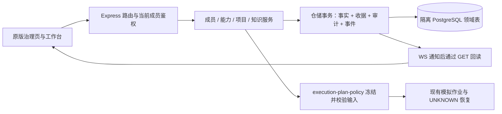

# 31 · R1 后续治理衔接方案与范围确认

> 状态：docs-only / light / DESIGN_PROPOSED，等待具体实施包确认。R1 已验收并合并推送 main；2026-09-13 已 fetch 核实 main/origin/main=`c3f6c1869d1dad06c9b316ff61cbce359eba8358`，开工时工作区干净。本轮按用户“继续”准备下一实施包，未获新源码、数据库或业务启用授权。方案分支 `feat/m2c-governance-replan`，开工提交 `b6b93ab`。

## 本轮改动（文件级清单）

白名单仅六份 Markdown：`AGENTS.md`、`docs/planning/prototype-v3/19-开发路线图-20260912.md`、`docs/planning/prototype-v3/20-Codex交接提示词-20260912.md`、本文件、`docs/planning/prototype-v3/README.md`、`output/pfc-workbench-prototype/README.md`。23 号规定的 feature 开工/收工提交与推送适用；本轮不合并 main。

父级 POD-PFC-001 / 原型 M2 / 候选 M2c-3。涉及 CAP-PFC-01/02/03/04/05 的交互与治理设计输入；正式 5 CAP / 26 Unit 的实施、集成、验收状态均不变。唯一 POD next route 保持 `POD-PFC-001/M2/R3a/artifact-collaboration-tdd`。治理、跨产物真实协作、测试验收/观察域及真实工具仍未完成。

## 工作计划与当前事实

1. 核对 19/20/21/23、29 的治理候选、30 的已验收交互与当前代码，辨明交付范围。
2. 将 R1 对权限、项目、绑定和上下文的要求落实到下一轮具体设计；列出原型/PRD 联动仍需的独立领域工作。
3. 更新候选文件、测试数据、门禁和证据兼容范围；完成差异自审与六文档入口同步。
4. 运行文档与配置检查，保存原文摘要，feature 收工提交推送，提交具体实施包供陈立确认。

已实读源码确认：服务端未挂载治理/项目路由；需求 DTO 的 projectId 仍为 null；PG 身份仍按启动配置的 name/tenant/role 匹配；计划基线只有阶段、材料修订和产物版本。R1 是独立 localStorage 合成演练，不能直接把演练 JSON 保存为领域事实。

另有两项验收衔接缺口：R1 架构脚本固定比较 a9eec73 和当轮白名单；M2c-2 与 R1 的部分门禁固定写入历史证据目录。下一实施方案必须明确允许修订这些测试入口，同时保留旧业务断言与历史证据；本轮不改测试源码。

## 验证结果（命令 + 输出摘要 + 证据路径）

固定 Node v24.20.0 / npm 11.19.0。根及 server 的 `npm ls --depth=0 --offline` 均退出 0，无安装或锁文件改动；Quick dry-run 为 READY_TO_RUN；`npm run check:config` 与 `npm run check:delivery-governance` 均退出 0。首次受限沙箱 spawn npm 返回 EPERM，改由自动审查执行相同有界只读检查后通过，没有资源耗尽或遗留服务。

源码/浏览器/PG 门禁未执行，当前仅方案准备。按 fullstack-quality-gate 的 docs-only 路径做静态/可读性核验，没有新增镜像实现的测试。六文档解析/链接与候选路径检查使用固定 Node 的 `--input-type=module` 内联程序（fs/path 与已安装 Prettier）：只读解析Markdown、逐个解析相对链接、核对候选文件是否存在及新增/修改类型、核对18个入口；结果如下：

```text
node --version -> v24.20.0
npm --version -> 11.19.0
npm ls --depth=0 --offline -> exit 0
npm --prefix server ls --depth=0 --offline -> exit 0
npm run test:gate:quick -- --dry-run -> GATE_STATUS READY_TO_RUN
npm run check:config -> BOOTSTRAP_CONFIG_OK node=24.20.0 policy=fail-closed
npm run check:delivery-governance -> DELIVERY_GOVERNANCE_OK pod=POD-PFC-001 caps=5 units=26 milestone=M2 next=POD-PFC-001/M2/R3a/artifact-collaboration-tdd
document check -> {"status":"PASS","docs":6,"links":79,"markdownParse":"PASS","candidateFiles":63,"existing":37,"new":26,"gates":18,"errors":[]}
git diff --check -> exit 0
```

以上是本轮执行输出摘要，现存 R1 的12闸/M2c-2的13闸只作为已验收历史依据，未冒充本轮复跑。无业务createdIds或测试服务；只留六份方案文档，合成证据/配置/数据库均未写入。

2026-09-13 01:12 +08:00 收工复核：`git diff --name-only -z c3f6c18 -- server output/pfc-workbench-prototype/original output/pfc-workbench-prototype/index.html docs/quality-gate .quality-gate apps packages archive` 无输出；`git ls-files --others --exclude-standard` 无输出；总差异仅六份白名单文档。只读解析忽略配置核实连接目标匹配127.0.0.1:5432/pfc_local/pfc_app_local，未连接数据库或输出敏感值。没有启动后台服务、浏览器或子代理，无遗留PID/端口需要关闭。

方案自审已完成：①将29历史“62项”简称还原为60个源码/测试路径，加3项R1测试适配，当前63项逐一核对；②保留已验收R1及旧迁移，明确历史测试白名单/输出目录兼容；③将作业快照和跨产物关联基线区分，保留后续缺口；④补明批准对象需要的003字段及配置变化的不同失效规则；⑤候选源码/PG包与当前六文档授权分开，18条候选闸没有预写PASS。无行为代码返工或功能测试结果，本轮指标仅记录方案开工提交、收工时间与Git改动量。

## 与交接包的差异（超范围项必须列出）

承接 29 原治理候选与 30 已验收的设计输入。本方案保留 29 的 D1–D6、003 表结构、接口及权限矩阵、G01–G13 验收意图，并用下面的衔接补充、精确白名单和测试包替换其中已过时的候选路径/日期/门禁数量。29/30 历史记录不覆盖、不改写。没有新增实施行为或更新正式台账。

## 诚实边界（模拟/未做/待确认）

R1 ACCEPTED 只指合成交互范围；本轮方案不是治理实现、真实集成、生产验收或发布。没有启动服务、数据库、浏览器、代理或真实工具，没有生成业务数据。

## 下一步（下轮任务参数建议）

建议确认下述方案 A，按 C1–C4 连续完成 M2c-3；确认覆盖 D1–D6、S1–S5、逐文件范围与隔离验证包。现阶段不需要填写真实账号或提供凭据。确认后从最新 main 开实施分支 `feat/m2c-governance`，带入本轮六份方案文档，续编 `32-M2c-3实施与验收-20260913.md`，先补失败测试再开发。日期型名称作为固定任务标识；若后续跨日仍使用此明确目标，不按当天日期自动扩展路径。

## 一、选择与产品交付结果

| 方案 | 交付结果 | 代价与边界 |
| --- | --- | --- |
| **A，建议：承接 29，先完成治理与上下文基础** | 在原页面登记成员、项目与能力，配置阶段默认/需求覆盖，作业计划准确展示所用输入和限制，刷新/重启后可恢复；配置真正约束模拟作业 | 复用已设计的领域路径；原型、PRD、验收项原子联动仍需要下一领域包 |
| B：先做原型/PRD/验收项的关联版本持久化 | 更早让 R1 的共同演进摆脱浏览器演练数据 | 需要新增产物、建议与关联基线契约；治理配置仍缺失，且需单独重拟完整白名单和验证包 |

推荐 A 是延续 25/29 的开发顺序，为后续真实协作提供稳定成员身份、输入来源和作业约束。R1 已解决此前“交互未定型”的阻塞；不建议继续做另一轮只改外观的原型。此建议尚未视为用户选择。

方案 A 完成后，用户在原版 PG 工作台能走通：登记项目 → 创建并关联需求 → 查看关键词命中的知识引用 → 查看本阶段有效能力 → 比较作业计划中的版本/项目/能力 → 由当前有权限的成员批准 → 查看模拟执行与持久化回读。治理页修改配置或权限后，工作台给出准确的后续动作。

“一份目标同时生成业务原型、PRD 和验收项”继续是正式产品目标；本轮不把能力绑定当成已经调用 AI，也不把登记项目当成已经获得目录执行权。R1 演练入口、八阶段交互和原三栏保持，PG 未接入的动作继续说明原因。

## 二、承接 29 的决策与 R1 衔接补充

以下六项以 [29 的第二至四节](29-M2c-3治理与项目方案及范围确认-20260912.md) 为具体规则来源；本节补充出现歧义时优先，但不扩大为真实工具或业务数据库操作。

| 决策 | 本轮拟实施的结果 |
| --- | --- |
| D1 成员与权限 | 固定 MEM-* 身份、允许名单登记、数据库当前角色/active 校验、软停用和最后 owner 并发保护；HTTP/WS/收据重放一致 |
| D2 能力与绑定 | 登记、复核、显式启用、版本不可变、团队阶段默认及本需求覆盖；计划冻结实际选用配置，停用能力阻断未启动计划 |
| D3 项目与需求 | 元数据登记、需求关联/换绑和 revision；活动作业时阻断换绑，无活动作业时使旧产物 stale；不扫描目录 |
| D4 知识 | 文本登记和有界关键词匹配，需求创建时最多三个版本化引用；有来源、无命中为真实空集合 |
| D5 审计与预算 | 业务命令和审计/事件/收据同事务，owner 有界 CSV 导出；预算只查询，未配置数字为 null，不虚构实际扣费 |
| D6 剩余范围 | 原型/PRD 联动、测试缺陷、产品验收、发布、观察及真实工具保留为待实现能力；003 日常启用另行确认 |

### S1 作业使用的上下文必须可比较、可追溯

在 29 的 `run_plans.context_snapshot / snapshot_version` 中保存**单个计划**的不可变输入记录。拟采用 `snapshotVersion=1`，内容由服务端在创建计划的同一事务中读出，客户端不得提交任意快照作为事实：

| 字段 | 语义与限额 |
| --- | --- |
| requirement | 需求 publicId、当前 stage、创建计划时 reqRevision、materialRevision；reqRevision 是追踪值，不作为所有配置变化都会让计划失效的全局开关 |
| artifacts | 本次开发计划所用的 idea/req/design 最新确认且非 stale 版本，记录 publicId、stage、version 和内容指纹；最多三个，不包含 R1 演练版本 |
| materials | 当前可用材料的 publicId、version、hash、allowed/usage；不复制原件或完整正文；最多 100 项 |
| project | 项目 publicId、revision、name/path/repo/branch/tech；未关联为 null，页面明确未关联，不自动挑选项目 |
| capabilities | 当时有效 cap 的 publicId、name、type/protocol、ver、fingerprint 及执行描述元数据，连同 stage binding revision 和需求覆盖记录；最多 100 项，不含凭据 |
| knowledgeRefs | 需求已保存的知识引用 ID、版本、匹配原因、摘要及指纹，最多三个；不重新跑匹配替换历史引用 |
| source / createdAt / fingerprint | source 固定为服务端领域快照；时间由服务端生成；稳定排序后计算 SHA256，不把 token、用户配置或文件原件放入响应/审计 |

整个快照序列化上限 512 KiB，超限返回 `CONTEXT_LIMIT_EXCEEDED` 并提示缩小引用范围；不得静默截断。项目 tech 最多 20 项、每项 80 字符，其余项目 name/path/repo/branch/source 上限分别为 160/2048/2048/160/40 字符；对应校验用在登记入口，避免创建计划时才发现无限增长。材料不可用时保留其真实状态与提示，不伪造已解析内容。

`GET /api/runs/:id` 的 plan 增加 `snapshotVersion/contextSnapshot/contextFingerprint`；具体字段在 32 和代码 contract 记录。原来的 baseline 继续承担阶段、材料和产物变化校验；新配置校验由 `execution-plan-policy` 分别完成，不能把整段 reqRevision 加入旧基线导致“调整默认能力使旧计划失效”。确认版本不会自动批准作业，作业批准也不代表验收/发布批准。

本轮保存的是作业输入快照，尚不是 R1 的跨产物关联基线或完整依赖图。没有输入记录的历史已结束计划显示“历史计划无上下文快照”，不回填伪造数据；缺快照的未启动计划要求重新创建并批准。

### S2 确认对象和权限有效期

普通 PG 工作台的身份来自当前服务端成员，页面“角色体验”不能赋予权限。计划批准绑定 run/plan ID、baseline、contextFingerprint 和审批人稳定成员 ID/当时角色及时间；启动时重新检查审批人批准权限、执行人控制权限及当前领域基线。快照来源可复用，批准对象不能偷换。

权限撤销在数据库命令与角色变更共用的租户锁下检查；失去权限后不能通过旧收据获得受限结果。已运行作业的内部模拟回执继续落事实，不自动改成失败。WS 的新消息/推送检查当前成员；本轮仍是 loopback 开发身份，未声称提供生产认证。

### S3 配置或上游变化后的准确动作

| 变化 | 待启动计划 | 已运行/UNKNOWN | UI 后续动作 |
| --- | --- | --- | --- |
| 团队默认能力或本需求覆盖调整 | 继续使用原冻结集合，仍须满足当前能力启用硬门 | 保留原快照与状态 | 显示“新配置用于新计划”，可查看原输入 |
| 所用能力停用；审批人降权/停用 | 拒绝启动，指出能力或审批原因 | 不伪造取消/完成；控制动作重验权限 | 新建计划并批准；UNKNOWN 先核验同一运行 |
| 材料/需求版本变化 | 原 baseline 校验失败 | 保留原记录，不冒充使用新版本 | 回读差异，按现有版本规则补新计划 |
| 换绑项目 | 任何 WAITING_APPROVAL/RUNNING/CANCELLING/UNKNOWN 都拒绝换绑 | 同左 | 先取消待批或活动作业，UNKNOWN 先核验；无活动作业后换绑，旧产物 stale |
| 409/断网/503/权限失效 | 不新增本地成功事实 | 回读同一 run/commandId；不靠前端 tick 推进 | 保留草稿及位置，比较服务端新状态后再提交；新载荷使用新 commandId |

“刷新配置”只更新当前可用配置/身份；不能覆盖用户正在比较的计划快照。项目换绑的 stale、需求 revision、关联变化与审计事件同事务完成，旧产物内容和历史审批不被重写。真正的跨产物增量更新留给下一领域包。

### S4 界面衔接与交互边界

治理页沿用原密集列表，登记表单保留错误和输入；项目明确“已登记，未扫描”，预算显示“未配置/未接入真实计量”。工作台左栏展示当前项目与知识来源，中部计划卡展示本次作业输入摘要/阻塞原因，右侧证据查看只读快照；不另造全屏门户。

受影响大文件只保留分派，业务校验/回读分别放新增治理 domain/view、membership-policy、execution-plan-policy。新渲染只在 PG 路径启用，原 local/mock/memory 的回归行为和 R1 独立存储不变。复用现有 base.css/guide.css 的变量、表单及提示，不新增页面局部视觉体系。

场景切换进入 R1 仍显式为本地演练；不把演练成员、产物或批准导入 PG。本轮真实 PG 浏览器回归覆盖普通工作台与共享三栏，补回 30 号所述“仅合成 PG DTO”的验证缺口；仍不能由此宣称 R1 全流程已经接入 PG。

### S5 门禁可以续用，历史证据不能覆盖

新增三份测试文件修改权限：`verify-flow-architecture.mjs`、`verify-flow-browser.mjs`、`flow-browser-fixture.mjs`（均位于原型目录）。原 M2c-2 两份 PG/API 浏览器脚本已在 29 白名单内，增加本轮证据输出适配。

R1 架构闸把“一次性交付审计”和“持续回归”区分执行：固定 a9eec73→c3f6c18 的历史差异审计保留；本轮候选范围从 c3f6c18 按本文件精确检查。演练五份源文件、workbench-shell、base/guide/model/data-layer 的受保护内容及无 API/SQL/原状态写入断言保留，24 种原 local 工作台渲染组合、加载顺序和下游变更控制仍需通过。治理获准改动的 domain/api 模块改由本轮契约、模式隔离和真实 PG 用例保护；不得简单删掉所有指纹检查或更新常量“跑绿”。

R1 浏览器输出与 M2c-2 domain/browser 输出须由显式、受限路径参数写入本轮证据目录对应子目录；没有有效新输出目标时拒绝覆盖历史报告。R1 `reference-shell.json` 始终从原已验收记录只读加载，校验来源指纹，不以本轮页面重采样作自身基准。若需要改变旧视觉断言，必须先展示具体差异再对齐。

## 三、架构、版本计划与剩余路线



003 表结构沿用 29 第三节，包含治理表、项目关联、计划快照与审计增补。为实现 S2，另在同一003中补充 `run_plans.approved_member_id / approved_role / approved_context_fingerprint`，成员关系用 tenant_id 组合外键；历史记录允许为空，新批准必须全部写入且与当前计划一致。已有 approved_by/approved_at 继续保留；新增字段不能用客户端角色或事后查询结果回填历史批准。此项属于对29的明确待确认契约增补。

不得改 001/002 校验和或用整树 app_state 替代。SQL 只由显式迁移工具应用；测试初始化成员独立执行，服务启动只做 readiness。当前 runtime 的测试文件根需精确增加本轮治理文件根，保留既有 domain 测试根和未启用的业务目标，不放宽为任意 `.local/`。

| 顺序 | 本轮实施内容 / 退出标准 | 后续仍需完成 |
| --- | --- | --- |
| C1 | 003、显式成员初始化、权限与 WS/并发/收据失败测试先行；缺成员/迁移拒绝启动 | SSO/真实身份仍按 M3 |
| C2 | 能力登记/复核/启用/绑定，S1 快照与 S2/S3 启动硬门 | 登记元数据不执行 Shell/MCP |
| C3 | 项目/知识/审计/预算与原 UI 回读，刷新/重启/三宽度/键盘可用 | 原型/PRD 联动尚待下包 |
| C4 | 18 闸、G01–G13 与新增衔接用例、独立 SQL/API/UI/清理证据，逐文件自审 | 陈立评审后才可记本轮 ACCEPTED；不自动合并 |

建议的 M2 剩余顺序为：M2c-3 治理基础 → **关联产物与上下文承接** → 测试用例/缺陷/产品验收 → 发布执行记录与观察回填。此处是待确认排序，不改原 M2c-4 的既有名称或正式台账；下一包需明确与既定发布子轮的依赖关系，不能把缺口消失在编号调整中。

关联产物包必须至少包含：原型/PRD/验收项独立版本与关联组、生成建议和来源、原子采纳/旧建议失效、业务确认与设计确认各自对象、上游变化影响/返回位置、下一阶段输入快照。业务原型文件的生成与隔离预览、可信附件引用要一起设计；没有真实 AI/工具适配时明确生成来源，不能把固定模板标成任意需求生成。先提交这一包的具体契约和范围，再实施；不会直接跳到全阶段自动编排。

正式 CAP/Unit 对应与标准持久化仍需按相邻方法仓库的确认版本核对；原型治理验收不推进旧正式工程台账。退出本轮后返回父级 POD，唯一 route 仍为 `POD-PFC-001/M2/R3a/artifact-collaboration-tdd`。

## 四、候选实施白名单（确认后才生效）

以下63个源码/配置/测试文件逐项有效（37个现有、26个拟新增），由29原表的60项加3项R1测试适配组成；下轮不可依据历史“62项”简称增删范围。每项职责继承29第五节，S1–S5是本轮补充。

| 路径 | 类型 |
| --- | --- |
| `server/sql/m2c/003-governance-projects.sql` | 新增 |
| `server/src/persistence/migrations.js` | 修改 |
| `server/src/persistence/members.js` | 新增 |
| `server/src/persistence/caps.js` | 新增 |
| `server/src/persistence/bindings.js` | 新增 |
| `server/src/persistence/projects.js` | 新增 |
| `server/src/persistence/knowledge.js` | 新增 |
| `server/src/persistence/governance-read.js` | 新增 |
| `server/src/persistence/identifiers.js` | 修改 |
| `server/src/persistence/commands.js` | 修改 |
| `server/src/persistence/requirements.js` | 修改 |
| `server/src/persistence/runs.js` | 修改 |
| `server/src/domain/membership-policy.js` | 新增 |
| `server/src/domain/member-service.js` | 新增 |
| `server/src/domain/capability-service.js` | 新增 |
| `server/src/domain/project-service.js` | 新增 |
| `server/src/domain/knowledge-service.js` | 新增 |
| `server/src/domain/governance-read-service.js` | 新增 |
| `server/src/domain/execution-plan-policy.js` | 新增 |
| `server/src/domain/execution-service.js` | 修改 |
| `server/src/domain/requirement-service.js` | 修改 |
| `server/src/domain/dto.js` | 修改 |
| `server/src/domain/events.js` | 修改 |
| `server/src/routes/caps.js` | 新增 |
| `server/src/routes/bindings.js` | 新增 |
| `server/src/routes/members.js` | 新增 |
| `server/src/routes/projects.js` | 新增 |
| `server/src/routes/knowledge.js` | 新增 |
| `server/src/routes/governance-read.js` | 新增 |
| `server/src/routes/reqs.js` | 修改 |
| `server/src/routes/auth.js` | 修改 |
| `server/src/auth.js` | 修改 |
| `server/src/access.js` | 修改 |
| `server/src/runtime.js` | 修改 |
| `server/src/index.js` | 修改 |
| `server/src/ws.js` | 修改 |
| `server/src/contract.js` | 修改 |
| `server/scripts/migrate-m2c.mjs` | 修改 |
| `server/scripts/initialize-m2c-members.mjs` | 新增 |
| `server/.env.example` | 修改 |
| `output/pfc-workbench-prototype/original/governance-domain.js` | 新增 |
| `output/pfc-workbench-prototype/original/governance-domain-view.js` | 新增 |
| `output/pfc-workbench-prototype/original/governance-actions.js` | 修改 |
| `output/pfc-workbench-prototype/original/governance.js` | 修改 |
| `output/pfc-workbench-prototype/original/actions.js` | 修改 |
| `output/pfc-workbench-prototype/original/spaces.js` | 修改 |
| `output/pfc-workbench-prototype/original/workbench.js` | 修改 |
| `output/pfc-workbench-prototype/original/domain-actions.js` | 修改 |
| `output/pfc-workbench-prototype/original/domain-view.js` | 修改 |
| `output/pfc-workbench-prototype/original/api-client.js` | 修改 |
| `output/pfc-workbench-prototype/original/ws-client.js` | 修改 |
| `output/pfc-workbench-prototype/index.html` | 修改 |
| `output/pfc-workbench-prototype/verify-static.mjs` | 修改 |
| `server/test-data/m2c-governance-fixture.mjs` | 新增 |
| `server/verify-m2c-governance.mjs` | 新增 |
| `output/pfc-workbench-prototype/verify-m2c-governance-browser.mjs` | 新增 |
| `server/test-data/m2c-domain-fixture.mjs` | 修改 |
| `server/verify-m2c-domain.mjs` | 修改 |
| `server/verify-m2c-architecture.mjs` | 修改 |
| `output/pfc-workbench-prototype/verify-m2c-browser.mjs` | 修改 |
| `output/pfc-workbench-prototype/verify-flow-architecture.mjs` | 修改 |
| `output/pfc-workbench-prototype/verify-flow-browser.mjs` | 修改 |
| `output/pfc-workbench-prototype/flow-browser-fixture.mjs` | 修改 |

文档白名单为本轮六文档，以及 `docs/planning/prototype-v3/32-M2c-3实施与验收-20260913.md`。32 用于实施检查点、精确 DTO、差异和验收；29/30 保留为历史，只读。新增报告 `docs/quality-gate/reports/m2c-3-governance-20260913.md`；证据根 `docs/quality-gate/reports/m2c-3-governance-20260913/` 下仅可写本次合成 JSON/PNG/Markdown，子目录仅 `governance/`、`domain/`、`flow/`、`legacy/`，根目录可写命令/指纹/清理/差异 JSON。不得写任意脚本、数据库备份、配置或真实业务内容到证据目录。

禁止范围：依赖与锁文件、历史 12/13、001/002、m1-schema.sql、旧报告/截图、archive/_backup/apps/packages、旧工程根脚本/测试、质量配置、正式台账，以及 R1 flow-* 五份源文件和共享 shell。上表目录不能外推为整个目录编辑权；必要文件遗漏时先给差异与原因，不静默扩大。

## 五、隔离数据、验证与清理包（待确认）

执行环境仅本机 Node24 / Express / PostgreSQL18，`127.0.0.1:5432` / `pfc_local` / `pfc_app_local`。沿用已安装依赖，不联网安装；连接配置只从忽略的 `.env.local` 读取并由现有目标校验器验证，不打印连接串或密码。下表三个 schema 是全部允许目标；开工预检必须不存在，按单个目标串行创建/使用/销毁。旧两个固定名称按已有工厂保留，不表示复用旧测试数据。

| 用途 | 精确 schema / runId | 数据、文件范围 |
| --- | --- | --- |
| 治理 PG 与浏览器 | `codex_test_m2c_20260913_governance` / `CODEx_TEST_M2C_20260913_governance` | ≤2,000 合成行，原件≤100 MiB；`.local/m2c-3-governance-20260913/files/<runId_attempt>/` |
| 现有领域与浏览器回归 | `codex_test_m2c_20260912_domain` / `CODEx_TEST_M2C_20260912_domain` | ≤2,000 行/100 MiB；原 `.local/m2c-2-domain-20260912/files/<runId_attempt>/`，先保留 001/002 原断言，再迁移 003 初始化合成成员 |
| 原 001 存储组件 | `codex_test_m2c_20260912_storage` / `CODEx_TEST_M2C_20260912_storage` | ≤200 行；组件仍只验证 001，不引入治理数据；原 `.local/m2c-1-storage-20260912/pg-<timestamp>/` 留合成输出 |

每个 attempt 为明确 runId 加 UUID；测试配置、文件清单、schema OID/marker/表白名单、createdIds、失败诊断留在对应任务的忽略目录。工厂构造两个合成租户、主租户两个 owner/executor/viewer/inactive/未登记允许账号、另租户 owner、受控模拟 bridge；名称和内容均为 CODEx_TEST_ 前缀。引用、权限、版本、并发、负面和边界数据沿用 29 第六节 G01–G13，补充下表；不使用真实 endpoint、仓库或用户文件。

| 补充场景 | 前置 / 步骤 / 预期 | 自动化与责任 |
| --- | --- | --- |
| G14 输入快照与原子性 | 工厂准备确认版本/材料/项目/能力/知识 → 创建计划 → GET+SQL → 改配置/重启；快照内容与指纹不变、当前视图变化可解释；缺失、跨租户和超限输入拒绝，无半个计划/成功审计 | 新治理 PG 专项；Codex 执行、陈立验收 |
| G15 批准对象及并发硬门 | 两窗口围绕同一计划批准、修改产物、停用能力/审批人，再启动；身份/基线错误拒绝，重复同命令不多建作业，默认绑定调整不误废旧计划 | 新治理 PG + 浏览器，需受控调度而非 sleep 猜顺序 |
| G16 上下文与草稿回读 | 在普通 PG 工作台查看项目/引用/计划 → 制造 409/503 → 刷新身份/恢复网络；草稿与比较对象保留、服务端事实独立回读，UNKNOWN 沿原 run 核验 | 三宽度 Edge + API/SQL；补 R1 的真实 PG 回归缺口 |
| G17 演练隔离与证据保护 | 原 R1 模型/浏览器/架构闸，普通 local/mock/memory 回归，运行前后历史证据 Git blob/文件指纹比对 | 不改 R1 五份源文件、不覆盖历史；新证据记录测试源指纹和引用来源 |

工厂预先验证数据业务有效性，以真实 API/仓储形成待测状态；直接 SQL 仅用于隔离初始化、故障设置和独立读回，不能用其代替被测操作。G01–G17 当前均为待实施/待执行，没有 PASS 或业务验收结论。

清理前确认绝对文件路径在精确根内，schema 的 OID/marker/所属角色、表清单和行数符合工厂记录；仅删除本 attempt 自建对象，独立 SQL/文件读回为零。目标已存在/归属变化/清理不完整即停止并保留脱敏证据，不按前缀扫描批删。不改数据库/角色/扩展，不触碰 pfc/public/pfc_workbench 或其他 schema。

本包确认后可按需临时启动本机 `pfc-postgresql-18` 并恢复原态；原服务已运行则保留。临时 API/模拟 bridge 用 5189–5196 中确认空闲端口，静态服务用系统分配 loopback 端口；冲突不杀未知进程。全部测试串行，最多一组 API/浏览器，PG 池最多两个连接，不启动并行代理。finally 关闭自建进程/连接池/context，报告 PID/端口/退出读回；不保留测试服务。

API 列表默认20/最大100，offset≤10,000；SQL 超时和连接超时沿用3秒、事务空闲5秒，导出≤10,000条/5MiB超限报错。512KiB 上下文上限与知识/材料/能力条数分别验证，不能靠上调 Express body limit 消除错误。无真实模型/工具开销，预算没有真实扣费；生产吞吐、长期增长和非 Edge 浏览器兼容留待后续，不虚构性能结论。

## 六、候选验收命令与交付判定

以下 **18 条入口** 均需有本次执行原文。固定 runtime 后串行运行；前九条是已确认的 memory/local/mock 工厂范围，清空 DATABASE_URL；第10/12/13/14/15条的 PG 目标由上述工厂注入。R1/PG 报告先配置本轮受限证据路径，原输出脚本适配完成前不得直接跑覆盖历史记录。

```powershell
$env:Path="$PWD\.tools\node-v24.20.0-win-x64;$env:Path"
node output/pfc-workbench-prototype/verify-prototype.mjs
node output/pfc-workbench-prototype/verify-m1-layer.mjs
node output/pfc-workbench-prototype/verify-m1-e2e.mjs
node server/verify-server.mjs
node server/verify-server-m2.mjs
node server/verify-m2b.mjs
node output/pfc-workbench-prototype/verify-m2b2-model.mjs
node server/verify-m2b2-domain.mjs
node output/pfc-workbench-prototype/verify-m2b2-browser.mjs
node server/verify-m2c-pg.mjs
node server/verify-m2c-architecture.mjs
node server/verify-m2c-domain.mjs
node output/pfc-workbench-prototype/verify-m2c-browser.mjs
node server/verify-m2c-governance.mjs
node output/pfc-workbench-prototype/verify-m2c-governance-browser.mjs
node output/pfc-workbench-prototype/verify-flow-model.mjs
node output/pfc-workbench-prototype/verify-flow-browser.mjs
node output/pfc-workbench-prototype/verify-flow-architecture.mjs
```

其中两份 governance 入口待新增；其余16条已存在，不代表本次运行。实施还需 `verify-static.mjs`、修改服务端源码的 `node --check`、配置/交付台账检查、001/002 checksum、六文档链接及 Git 白名单/差异检查。旧工程未改，不用原型18闸替代其将来变更所需的 Quick/Core/Full。

完成 C1–C4、G01–G17、18闸与独立清理后才可记本轮 LOCAL_VERIFIED，陈立对具体版本进行业务/视觉/工程/测试/安全评审后才记 scoped ACCEPTED。自动化结果、人工接受、正式 CAP/Unit 验收、业务启用和生产发布分别记录。输出 32、质量报告、完整命令/失败历史、SQL/API/UI/三宽度截图、前后源码/历史证据指纹、变更清单和未验风险，再按23 feature提交推送；main合并须以届时具体差异评审授权为准。

本轮不部署，release/post-release smoke/观察窗口为 NOT_EXECUTED。若之后启用业务 PG，另行提交含003与成员初始化的目标/账号/文件根预检、同点数据库与文件备份、回退及观察方案；不能用回退旧代码搭配新业务 schema。当前隔离测试失败只清理自身对象，不对业务库做回退。

收工记录真实开工/结束时间、改动量、失败门禁、重做次数与缺陷来源；无发布后数据时明确无数据。越权、重复推进、计划快照被改写、旧证据覆盖或资源错误时停止受影响步骤并保留证据。

## 七、需要确认的具体包

**建议确认：方案 A + 29 的 D1–D6（以31的 S1–S5补充为准）+ 第四节精确文件/证据范围 + 第五节三个隔离 schema 与文件、临时PG启停/清理包 + 第六节18条验收入口。**这一次确认支持 C1–C4 内连续工作和23的 feature提交推送，不在每个检查点重复询问。源码实现、测试和清理均在本包内完成；遇到新增接口含义、目录执行、业务库启用或范围外文件再对齐。

确认要求来自 [AGENTS 的当前交接范围](../../../AGENTS.md) 中 “any new implementation requires its own confirmed design and exact scope”，以及 [23号](23-Codex防走偏协议-20260912.md) 的范围锁和差异评审，并承接用户“有疑问要和我对齐，不能私自决定”。fullstack-quality-gate 用于匹配验证范围，未新增审批要求。
