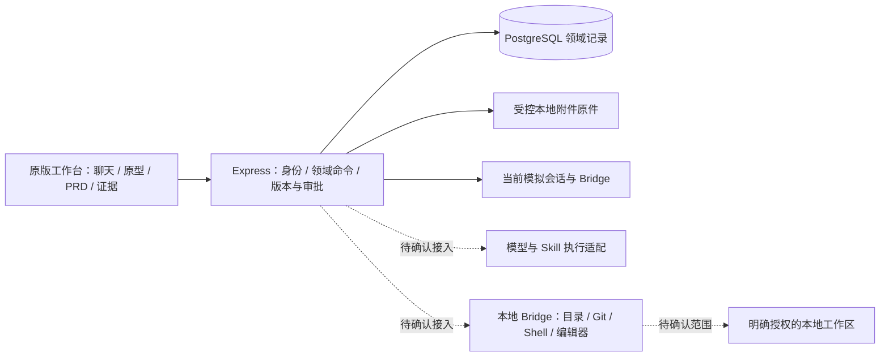

# 39 · 原型能力核对与后续路线建议

> 最新确认：陈立已对2642524验收、main合并推送及40号方案回复“确认”。本能力核对随验收收尾入库；后续选择A方向，先完成本地可用基线设计。新增实现、业务PG及真实工具仍待具体包确认。

## 本轮范围与计划

分类为 docs-only / light。继续工作的源码基线是 `26425240340ab813b8d9e0f60765df02f11f1140`，当前分支 `feat/m2c-release-observation`；本轮刷新后的 `origin/main` 为 `068972367660285e5dc5665b6021c33edb60f75f`，远端 feature 与源码基线一致。

本次仅新增本文件，不修改源码、SQL、依赖、正式台账或历史报告。工作步骤：核对交接与基线 → 对照 5 CAP / 26 Unit → 明确现有能力和缺口 → 给出下一轮选择及确认入口 → 检查来源、链接、格式和保护指纹。初次核对时保留为工作区草案；当前用户已确认随验收收尾入库，再从main另开40号文档分支。不借用上一轮测试写入授权。

父任务 `POD-PFC-001`，正式里程碑 M2。本文核对全部 CAP-PFC-01～05、26 个 Unit，不改变它们的实现、集成或验收结论。正式唯一下一路线仍为 `POD-PFC-001/M2/R3a/artifact-collaboration-tdd`。原型 M2c-4 为 LOCAL_VERIFIED / ISOLATED_PG_VERIFIED / SCOPED_ACCEPTED，业务运行未启用，真实发布未执行。

## 一、当前结论

原型已经形成八阶段的连续工作台，以及材料、关联版本、测试验收、发布观察等领域记录。现有代码和回归足以作为后续设计的具体输入，但仍不能称为生产系统：普通对话没有接真实模型，能力目录没有实际调用执行器，项目路径未扫描，发布结果和观察指标来自人工登记；日常业务 PG、身份体系和运行保障仍需补齐。

现在最有价值的下一步，是明确从“隔离环境验证的原型”进入“本人可持续使用的本地平台”的最小版本，同时保持原型与 PRD 同步形成的工作方式。无需重新画一套工作台，也不应根据某个页面或接口已经存在就把对应生产能力标为完成。

本次核对来源如下；历史验证仅在当前文件指纹仍匹配时引用，不当作本轮重新执行。

| 来源                                                                                                                                                                                             | 本次用途                                            |
| ------------------------------------------------------------------------------------------------------------------------------------------------------------------------------------------------ | --------------------------------------------------- |
| [19 路线图](19-开发路线图-20260912.md)、[20 任务模板](20-Codex交接提示词-20260912.md)、[23 协议](23-Codex防走偏协议-20260912.md)                                                                 | 当前交接、技术路径与验收边界                        |
| [29 连续协作要求](29-M2c-3治理与项目方案及范围确认-20260912.md)、[30 R1 验收](30-连续协作原型实施与验收-20260912.md)                                                                             | 原型先行、PRD/AC共同演进和八阶段演练                |
| [28 领域接入](28-M2c-2实施与验收-20260912.md)、[32 治理](32-M2c-3实施与验收-20260913.md)、[34 关联产物](34-R2关联产物实施与验收-20260913.md)、[36 测试验收](36-R3测试验收实施与验收-20260913.md) | 已有各轮隔离验证与范围验收记录                      |
| [38 M2c-4 交接](38-M2c-4发布观察实施与验收-20260913.md)、[最终门禁证据](../../quality-gate/reports/m2c-4-release-observation-20260913/gates-recovery-final.json)                                 | 30 项命令、末次复测来源和 63 个当前源码指纹         |
| [正式交付台账](../../../.quality-gate/delivery-plan.json)                                                                                                                                        | 仅抄录正式状态，不能由原型证据代替其验收            |
| [方法主 Spec](../../../../product-full-chain/.work/reviews/estimation/POD-PFC-001/POD-PFC-001-产品作业全链路管理平台-主Spec_V0.1.md)                                                             | 第 270–295 行的 26 个 Unit 定义；不修改相邻方法仓库 |

## 二、5 CAP / 26 Unit 对照

下表中的“原型已有”表示当前原生 JS / Express 路径；集成证据均限原轮次的合成数据与隔离环境。“正式台账”是本次读取的原值，不是本轮重新评定。各 CAP 的正式验收仍分别为 BLOCKED 或 NOT_STARTED。

| Unit           | 能力                 | 原型已有及验证依据                                  | 尚缺的实际能力或确认                                                 | 正式台账   |
| -------------- | -------------------- | --------------------------------------------------- | -------------------------------------------------------------------- | ---------- |
| UNIT-PFC-01-01 | 需求工作清单         | 工作台、阶段/责任人/阻断及读回；28                  | 日常持久运行与本人试用验收                                           | INTEGRATED |
| UNIT-PFC-01-02 | 想法与材料登记       | 需求创建、原件上传、附件版本、引用及撤权；28/34     | 模型对文件内容的真实解析与引用质量；日常原件恢复                     | INTEGRATED |
| UNIT-PFC-01-03 | 问答与决策确认       | 对话/回答持久化、决定和版本承接；28/34              | 普通对话仍为模拟回复；真实模型澄清、取消和恢复                       | INTEGRATED |
| UNIT-PFC-01-04 | 门禁运行与路由       | 阶段、版本、权限与证据校验；28/34/36/38             | 自动测试或外部工具的可信结果接入                                     | INTEGRATED |
| UNIT-PFC-01-05 | 上下文恢复与时间线   | API读回、版本/消息/事件恢复；28及后续浏览器回归     | 日常运行备份恢复、长时断连与观察证据                                 | INTEGRATED |
| UNIT-PFC-02-01 | 阶段产物目录         | 原型/PRD/AC关联版本与阶段输入；34                   | 业务实例上的完整性验收                                               | INTEGRATED |
| UNIT-PFC-02-02 | 产物生成或检查请求   | 模板、手工及受控文件导入候选；34                    | 真实模型/Skill按上下文生成候选；当前模板不代表AI生成                 | INTEGRATED |
| UNIT-PFC-02-03 | 版本查看、编辑与比较 | 候选差异、关联采纳、历史版本与受控预览；34          | 真实AI生成结果的结构校验和差异采纳联调                               | PLANNED    |
| UNIT-PFC-02-04 | 产物评审与确认       | 业务/设计确认绑定版本、成员和范围；34               | 真实协作身份和正式角色验收                                           | PLANNED    |
| UNIT-PFC-02-05 | 双向追踪             | 页面ruleId、PRD规则、AC、交付/测试证据关联；34/36   | 完整需求→CAP→Unit→AC双向查询及覆盖验收，不能由ruleId关联推断已全覆盖 | PLANNED    |
| UNIT-PFC-03-01 | 发起Agent作业        | 计划、上下文快照v2、批准、租约；32/34及模拟执行回归 | 真实执行器与本地授权目标绑定                                         | INTEGRATED |
| UNIT-PFC-03-02 | 实时执行事件         | WS模拟Bridge输出、回放及前端恢复；24/28             | 真实模型/PTY事件、背压及长时断连                                     | INTEGRATED |
| UNIT-PFC-03-03 | 范围审批             | 计划/版本/角色校验与审计；24/32/34                  | Shell文件写、网络和进程动作的实际执行前检查                          | INTEGRATED |
| UNIT-PFC-03-04 | Web/Zed作业交接      | 双终端镜像与演练入口；24/30                         | 同一真实runId的编辑器打开、接管、交回及冲突处理                      | PLANNED    |
| UNIT-PFC-03-05 | 作业恢复与控制       | 模拟作业取消、UNKNOWN、读回及事件去重；24/28        | 真实进程树停止、重连核实和副作用恢复                                 | INTEGRATED |
| UNIT-PFC-03-06 | 结果与证据归档       | 模拟运行记录及人工交付/测试证据；28/36              | 真实变更、命令退出码、工具产物与业务版本绑定                         | PLANNED    |
| UNIT-PFC-04-01 | 团队工作空间         | 本地账号/租户上下文，隔离测试；28/32                | 团队入口、生产租户配置与身份接入的完整验收                           | INTEGRATED |
| UNIT-PFC-04-02 | 成员角色与分工       | Owner/Executor/Viewer、停用/降权即时门控；32/38     | SSO/SCIM或经确认的本地身份方案                                       | INTEGRATED |
| UNIT-PFC-04-03 | 仓库工作区登记       | 项目路径/仓库/分支元数据与需求绑定；32              | 真实目录和Git状态扫描，当前明确scanned=false                         | INTEGRATED |
| UNIT-PFC-04-04 | 本地桥接器配对       | 模拟Bridge注册/在线状态及租户约束；24/28            | 真实设备身份、配对撤销、版本和工作区授权                             | INTEGRATED |
| UNIT-PFC-04-05 | 权限与执行审计       | 领域变更、具名评审、权限与审计查询；32/38           | 真实执行前后审计、敏感日志与生产保留策略                             | INTEGRATED |
| UNIT-PFC-05-01 | 提测交接与测试映射   | AC提前生成测试草稿、版本化交付基线；36              | 真实代码和测试程序同版本回填                                         | PLANNED    |
| UNIT-PFC-05-02 | 测试与产品验收       | 人工结果、缺陷回归、Owner验收；36                   | 自动测试结果的可信接入及业务实测                                     | PLANNED    |
| UNIT-PFC-05-03 | 发布准备评审         | 冻结准备单、Owner重评、证据与权限校验；38           | 本次原型已验收；真实发布目标/授权仍需另定                            | PLANNED    |
| UNIT-PFC-05-04 | 发布与观察记录       | 人工发布/回退、UNKNOWN核实、指标与遗留项；38        | 自动CI/部署/监控接入及外部事实核实                                   | PLANNED    |
| UNIT-PFC-05-05 | 最终验收与复盘       | 目标对比、具名结案、复盘及知识预填；38              | 真实观察窗口、实际业务成效及最终业务验收                             | PLANNED    |

没有给出“完成百分比”：26 个 Unit 的工作量不等，而且原型实现、隔离集成、正式验收的分母不同。将这些状态混算会掩盖最关键的真实执行缺口。

## 三、需要补齐的产品能力

以下是当前源码或证据直接支持的缺口；优先级用于方案讨论，不作为新增开发授权。

| 缺口                     | 当前证据                                                                                                                                                                                 | 进入下一版本时应明确的行为                                                                         |
| ------------------------ | ---------------------------------------------------------------------------------------------------------------------------------------------------------------------------------------- | -------------------------------------------------------------------------------------------------- |
| 真实AI对话与材料理解     | [conversation-service](../../../server/src/domain/conversation-service.js)明确生成“模拟回复”；上传保存不等于模型已理解附件                                                               | 明确可发送材料、引用版本、解析失败/不支持类型、费用与停止；回答可追溯到实际输入                    |
| 原型与PRD/AC联合生成     | [artifact-service](../../../server/src/domain/artifact-service.js)目前接受template/manual/import；模板内PRD规则需要人工完善                                                              | 模型一次形成关联候选；允许先看原型，再在同一组中完善PRD和AC；不重复抄上下文                        |
| 多种原型表达             | [prototype-preview](../../../output/pfc-workbench-prototype/original/prototype-preview.js)执行固定渲染器；[artifact-policy](../../../server/src/domain/artifact-policy.js)区分spec和file | 保留安全结构化预览；复杂原型如何导入、只读展示或在隔离浏览器运行须先确认，不能直接开放任意HTML执行 |
| 工具发现与实际调用       | [capability-service](../../../server/src/domain/capability-service.js)显示“仅登记，未调用”；[execution-plan-policy](../../../server/src/domain/execution-plan-policy.js)只冻结能力上下文 | 区分已登记、环境已发现、可调用、调用中及失败；按阶段装配能力时使用可验证的版本和权限               |
| 本地项目和Shell交互      | [project-service](../../../server/src/domain/project-service.js)返回scanned=false；[sim-bridge](../../../server/sim-bridge.mjs)是协议模拟器                                              | Browser→服务端→本地Bridge→指定目录/工具；先有目录检查和只读扫描，再确认写文件/命令动作             |
| 日常持久运行与身份       | [runtime](../../../server/src/runtime.js)支持显式006 PG就绪；[auth路由](../../../server/src/routes/auth.js)仍是配置姓名的dev-login；[服务入口](../../../server/src/index.js)使用通用cors | 固定入口、显式配置、身份边界、来源限制和重启恢复；姓名选择不作为团队或公网安全身份                 |
| 自动测试、CI及监控       | [release路由](../../../server/src/routes/releases.js)对execute/rollback/cicd明确返回CAPABILITY_UNAVAILABLE；人工结果保持来源标记                                                         | 先接只读结果和证据，再独立确认实际执行目标；人工、模拟和外部已核实来源分别展示                     |
| 完整追踪、知识与运行保障 | 当前ruleId/AC关联、[知识服务](../../../server/src/domain/knowledge-service.js)手工登记与关键词匹配；无本轮生产观察证据                                                                   | 明确CAP/Unit追踪、知识采纳责任、备份同点恢复、容量/保留、长时运行和升级回退                        |

其中身份、CORS等仅是源码已见的设计边界，本轮没有对运行服务实施攻击或复现生产漏洞，也未读取私人配置值。真实模型供应商、调用协议和编辑器版本没有在本轮选型，不能据本文推断兼容性已经核验。

## 四、架构承接

当前实施入口仍是 `index.html + original/ → server/ Express → PostgreSQL/本地原件`。`apps/`、`packages/`中的React/Fastify/Bridge是保留工程，未接入本原型主线；其已有实现与正式台账不能直接算入当前原型。

后续设计优先复用已有领域命令、关联版本、上下文快照、commandId、事件与证据规则。模型和工具返回候选或执行事实，由服务端校验、落库并读回；只有当前版本的证据能推进阶段。前端继续负责展示和意图输入，不直接运行Shell、Git或数据库命令。

正式工程与当前原型的接入方案必须单独对照：哪些契约可以复用、哪些依赖旧框架、哪些需要迁移，不直接搬入旧Bridge或改正式台账。本文不重选技术栈。

## 五、后续路线选择

### 推荐次序（A方向设计已确认，后续实施待确认）

| 顺序                          | 本版用户收益                                      | 退出证据                                                                                 | 保留的后续范围                          |
| ----------------------------- | ------------------------------------------------- | ---------------------------------------------------------------------------------------- | --------------------------------------- |
| 0. 关闭M2c-4验收              | 确定原型交付基线                                  | 陈立确认2642524，按23记录验收后合并及远端读回                                            | 不由验收自动启用业务PG或真实执行        |
| 1. 本地可用基线方案与受控试用 | 需求、附件和版本在固定入口持续保存，重启后可恢复  | 明确配置/身份/目标后，数据库与原件同点备份恢复、本地启动/停止/升级演练、本人完整流程试用 | 团队联网、真实AI和Shell仍按各自范围接入 |
| 2. AI联合产物与连续协作       | 一次意图形成原型+PRD+AC候选，修改只更新受影响部分 | 一条真实但无敏感材料的需求，能追溯输入/模型/Skill版本，停止与失败可恢复，候选显式采纳    | 真实代码写入、发布和部署另行确认        |
| 3. 本地执行与编辑器交接       | 同一需求调用本地工具，执行进展与代码变化可读回    | 从目录/Git只读扫描开始，再逐项验证已授权Shell/代码写、取消、UNKNOWN核实及同runId交接     | CI/生产发布和公网服务后续接入           |
| 4. 团队与外部集成             | 多人真实身份、可信测试/CI/监控事实和长期运行      | SSO/租户/WS/限流、凭据、外部回调幂等、恢复、观测与正式验收                               | 生态市场、向量检索按实际需求拆分        |

顺序1和2的设计材料可以共同准备，但不并行修改同一领域状态机或拆成多代理任务。是否让AI联合产物先于本地持久试用，由陈立决定；没有基于旧M3/M4编号擅自推迟AI价值。

| 选择                                            | 取舍                                                                   | 本次建议                                             |
| ----------------------------------------------- | ---------------------------------------------------------------------- | ---------------------------------------------------- |
| A：先确认本地可用基线，AI接入作为下一份独立设计 | 先建立日常数据和身份边界，后续模型/工具接入可复用；首版仍保留模拟回复  | 推荐；本地原件与领域记录已有隔离实现，接入路径更清楚 |
| B：先设计AI联合产物，在隔离样本上验证           | 更早验证AI体验；日常业务存储仍待启用                                   | 可选；需要先确定执行提供方、样本材料、费用与输出契约 |
| C：立即接入真实Shell与完整部署                  | 最快触达真实执行，但同时涉及目录权限、身份、进程、数据、凭据及外部结果 | 不作为本次默认范围；应先形成具体执行包               |

用户已选择A方向的文档设计，B/C保留为后续备选。本文没有新增实施文件白名单、数据库写授权、模型费用或真实工具授权；路线编号不替代正式POD下一路线。

### A方案的下一份设计交付（文档工作已确认）

建议续编40号《本地可用基线接入方案与范围确认》，仍先做文档设计。它应一次给出可执行包，避免边实现边补范围：

1. **入口与运行。** 沿用原版工作台；明确本地HTTP入口、API端口、启动检查、失败提示和停止方式，不依赖现有3001/5173旧工程服务。
2. **身份与权限。** 确定仅本人本机还是局域网多人。推荐首轮仅本人loopback试用；列明现有dev-login、CORS、令牌及本地账号的处理方式，不将本机信任假设推广到团队。
3. **数据库与原件。** 将候选 `127.0.0.1:5432 / pfc_local / pfc_workbench`、`.local/pfc-workbench-files` 与旧 `pfc` 分开核对。先只读预检目标有无数据，不能默认空库；显式迁移、配置键、安全注入和原件同点备份/恢复写入方案。
4. **试用数据与回退。** 默认从空白需求开始，不导入local/mock种子、旧业务数据或他人材料；验证用合成工厂，日常试用数据另列保留策略。设计隔离恢复演练，再确认业务目标写入范围；不以删除schema作为日常回退。
5. **兼容与成本。** 声明DB池/SQL/API超时、附件容量、日志保留、PC三宽度及支持浏览器。首轮不产生模型费用；多人容量及长期稳定性未实测时不得给无依据指标。
6. **精确授权与验证。** 文件白名单、配置来源、允许命令、网络/数据目标、上限、清理/保留、stop条件、原30闸与新增接入验收命令必须全部列出。源码实现、新依赖、业务DDL、服务启用和外部调用分别确认。

候选文档轮仅涉及 `AGENTS.md`、19、20、新40、两份README；39作为本次核对结论保留。新文档分支应从已验收且刷新的main建立，按23开工/收工提交推送。候选实现清单由40根据实际配置/入口代码确定，本文件不以目录通配符授权。

## 六、连续协作验收场景

这些是后续设计必须覆盖的验收方向，状态均为 NOT_RUN，不是本轮新测试通过记录。测试执行人Codex，业务/视觉接受人为陈立；先使用确定性合成工厂，每个场景带runId、创建ID、权限/版本前置和清理读回。

| 场景                 | 前置与动作                                | 可观察的通过条件                                                              |
| -------------------- | ----------------------------------------- | ----------------------------------------------------------------------------- |
| 空白需求到第一版候选 | 本地授权身份，新建需求并输入意图/合成材料 | 同一需求出现可交互原型、PRD草稿和AC；未确认内容保持草稿，无自动冒充人工批准   |
| 规则变化             | 已有候选；只修改一个业务规则              | 同屏看到受影响页面、PRD段落和AC；显式采纳后版本一致，未变化内容保留           |
| 文件理解失败         | 上传不支持格式、损坏或无权限材料          | 原件状态与解析状态分别说明；不能用通用回复假称已理解，用户可以移除/替换后继续 |
| 阶段衔接             | 已有确认版本、权限和有效证据              | 下阶段自动带入同版本输入，只补缺项；无重复复制/签署，失效项有原因和恢复入口   |
| 中断、超时与未知     | 运行中停止、服务断连或写后读回失败        | 已保存内容可恢复；沿原command/run核实，未核实前不重复执行、不显示伪成功       |
| 本地工具访问         | 已明确授权目录、动作和时间范围            | 读取/写入只发生在范围内；越界拒绝，取消后进程树结束，结果可独立读回           |
| 升级与恢复           | 数据库和附件同点备份；隔离恢复目标        | 恢复后版本与附件摘要一致，权限和历史可读；业务原库不因演练被覆盖              |

## 七、本轮验证与复审

已执行环境核验：项目固定Node `v24.20.0` / npm `11.19.0`；根及server的 `npm ls --depth=0 --offline`通过，复用安装；`npm run test:gate:quick -- --dry-run`输出 READY_TO_RUN，仅为门禁计划。

本次重新读取最终门禁JSON，30项记录均PASS；全部63源码SHA256与该证据一致，2806个受保护文件与原基线一致。没有重新运行30条业务回归、创建数据库测试数据、启动浏览器、临时服务或子代理。不以既有门禁代替本文件复审。

| 本轮实际检查                                             | 结果                                                                |
| -------------------------------------------------------- | ------------------------------------------------------------------- |
| `node scripts/check-config.mjs`                          | PASS：`BOOTSTRAP_CONFIG_OK node=24.20.0 policy=fail-closed`         |
| `node --import tsx scripts/check-delivery-governance.ts` | PASS：`DELIVERY_GOVERNANCE_OK`，5 CAP / 26 Unit / M2 / 原next route |
| 本文件 `prettier.format` 后 `prettier.check`             | PASS，使用已有项目配置，没有修改格式规则                            |
| Markdown链接逐项本地存在性检查                           | PASS：26个链接，失效0                                               |
| 表格Unit编号与正式台账集合比较                           | PASS：26行，无缺漏、额外或重复Unit                                  |
| 63源码与2806保护文件原始SHA256比较                       | PASS：漂移均0；用于复用原门禁证据，不冒充重新执行                   |
| `git status --short --branch`                            | 仅新增本39号，当前feature没有源码或已跟踪文件修改                   |

本次检查通过现有Node程序和一次性只读脚本执行；没有新增测试程序、凭据文件或数据样本。源码检索时纠正了不存在的旧文件名，最终依据实际的execution-service.js及其相关模块，不将路径猜测作为事实。

中文复审采用功能方案标准：核对目标/范围、来源、角色、状态/异常、验收和待确认项。已将“正式台账状态”“原型已验证”“真实执行尚缺”分开；没有按完成比例删减Unit，没有把模板生成或人工结果改称真实AI/外部效果。本文是设计输入，无法替代人工验收或生产授权。

## 八、待确认与交接

- 已确认：2642524通过本轮视觉/业务验收，按23完成main合并推送。
- 已确认下一步：A方向，继续40号本地可用基线设计。仅授权文档，不等于授权实现、数据库写入、模型费用或真实工具执行。
- A的首轮目标：建议仅本人本机loopback试用；是否要求多人局域网使用需在40写清，不能使用未经确认的身份假设。

初次核对仅新增本39号；本次接受后随38号验收记录及交接入口一起收尾。按23完成主干收尾，40号设计从刷新后的main开工。正式POD/里程碑/26 Unit状态及唯一下一路线保持本文开头所列值。历史证据原位保留；没有新增常驻进程、测试数据或外部执行结果。
